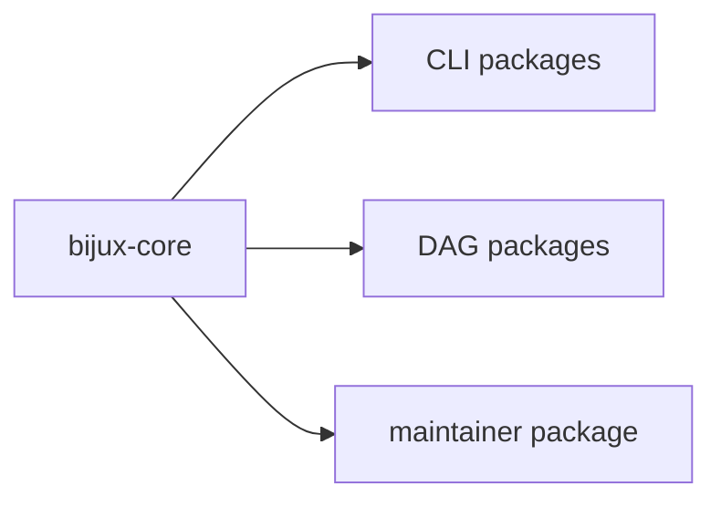

# Package Ownership

This page explains how `bijux-core` keeps ownership stable as the workspace
grows.

Each package family carries a different kind of responsibility. The point of
the split is simple: changes stay easier to review when command behavior, graph
behavior, Python distribution, and repository proof do not drift into one
another.

## Ownership Map

## Package Boundaries

- `crates/bijux-cli`: CLI command runtime and plugin behavior
- `crates/bijux-dag-core`, `crates/bijux-dag-artifacts`, `crates/bijux-dag-runtime`,
  `crates/bijux-dag-app`, and `crates/bijux-dag-cli`: DAG parse/run/replay/diff
  and artifact behavior
- `crates/bijux-cli-python`: Python package and bridge behavior
- `crates/bijux-dev`: maintainer automation, suites, and evidence reports

## Ownership Rules

- ownership claims must map to real crate/module paths
- cross-crate changes require coordination in all owning docs
- packages must not silently redefine another package's public contract

## Reading Rule

Open the CLI or DAG handbooks when the feature boundary is already clear. Stay
here when the change crosses package families and the first job is to decide
who owns the behavior.

## Code Anchors

- `crates/bijux-cli/src/lib.rs`
- `crates/bijux-dag-app/docs/CONTRACTS.md`
- `crates/bijux-dev/docs/CONTRACTS.md`
- `docs/bijux-cli/index.md`

## Next Reads

- [Change Management](../operations/change-management.md)
- [Decision Record Policy](decision-record-policy.md)
- [Dependency Direction](../architecture/dependency-direction.md)
