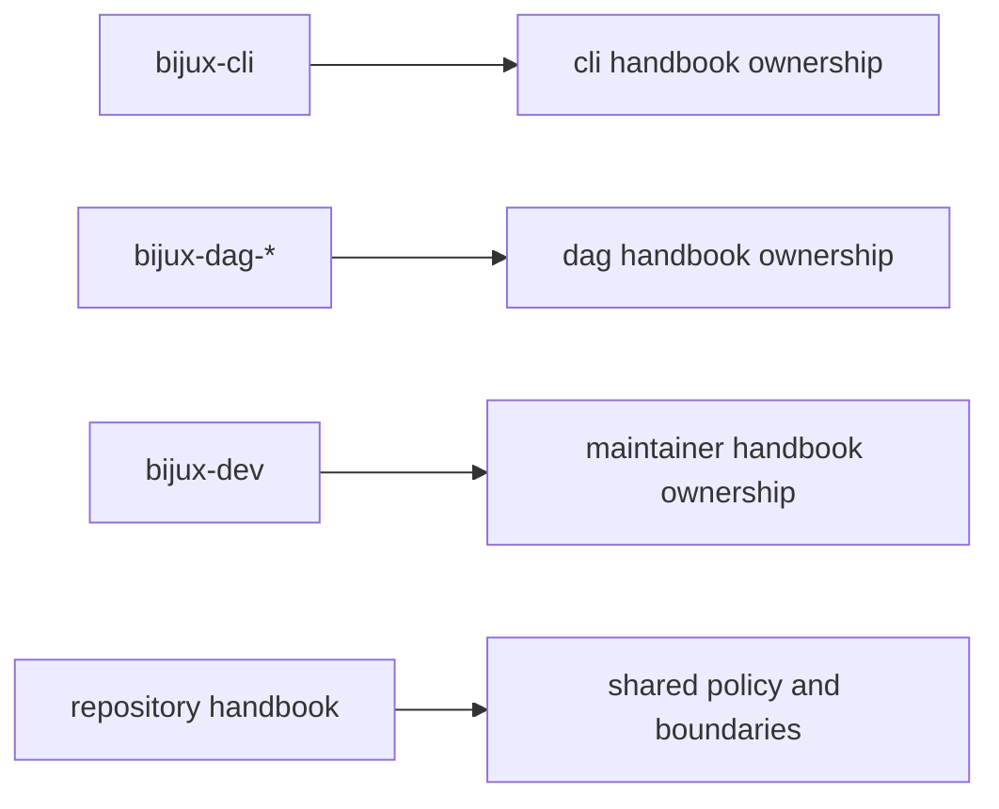

# Package Ownership

Package ownership keeps responsibilities stable and prevents hidden coupling
between product and maintainer layers.

## Visual Summary

## Ownership Map

- `crates/bijux-cli`: CLI command runtime and plugin behavior
- `crates/bijux-dag-*`: DAG parse/run/replay/diff and artifact behavior
- `crates/bijux-cli-python`: Python package and bridge behavior
- `crates/bijux-dev`: maintainer automation, suites, and evidence reports

## Ownership Rules

- ownership claims must map to real crate/module paths
- cross-crate changes require coordination in all owning docs
- packages must not silently redefine another package's public contract

## Code Anchors

- `crates/bijux-cli/CONTRACT.md`
- `crates/bijux-dag-app/CONTRACT.md`
- `crates/bijux-dev/CONTRACT.md`
- `docs/bijux-cli/index.md`

## Next Reads

- [Change Management](change-management.md)
- [Decision Record Policy](decision-record-policy.md)
- [Dependency Direction](../architecture/dependency-direction.md)
