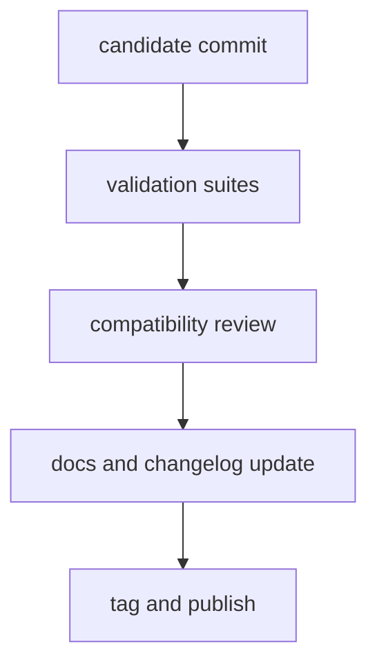

# Release and Versioning

This page explains how release policy keeps published versions tied to verified
repository state.

Versioning is only meaningful if it reflects real compatibility and real
published behavior. That is why this page treats release notes, docs, and
verification as part of the same release decision.

## Release Flow

## Release Rules

- release from verified commits only
- document compatibility impact for all public behavior changes
- ensure CLI and DAG release notes include contract-sensitive updates
- include documentation updates in the same release train

## Versioning Rules

- incompatible behavior changes require explicit major version rationale
- additive, compatible behavior follows minor version policy
- patches must avoid silent contract changes

## Reading Rule

Use this page when a change may be releasable but the version impact is still
unclear.

## Code Anchors

- `.github/workflows/`
- `crates/bijux-dev/src/suites/release.rs`
- `crates/bijux-dev/src/commands/cli_release_command.rs`

## Next Reads

- [Compatibility and Schema](compatibility-and-schema.md)
- [Risk and Exceptions](risk-and-exceptions.md)
- [Decision Record Policy](decision-record-policy.md)
