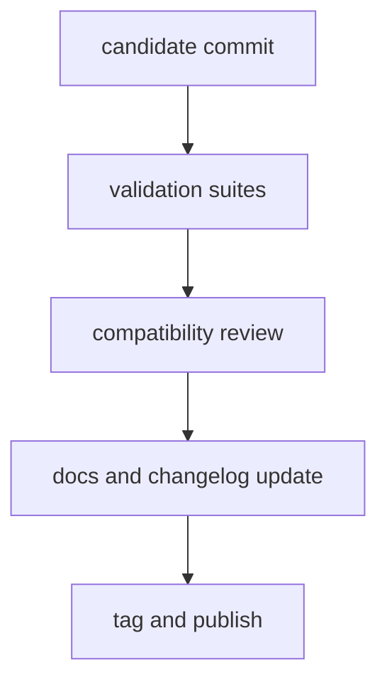

# Release and Versioning

Release and versioning policy coordinates CLI, DAG, Python bridge, and docs so
published behavior matches verified repository state.

## Visual Summary

## Release Rules

- release from verified commits only
- document compatibility impact for all public behavior changes
- ensure CLI and DAG release notes include contract-sensitive updates
- include documentation updates in the same release train

## Versioning Rules

- incompatible behavior changes require explicit major version rationale
- additive, compatible behavior follows minor version policy
- patches must avoid silent contract changes

## Code Anchors

- `.github/workflows/`
- `crates/bijux-dev/src/suites/release.rs`
- `crates/bijux-dev/src/commands/cli_release_command.rs`

## Next Reads

- [Compatibility and Schema](compatibility-and-schema.md)
- [Risk and Exceptions](risk-and-exceptions.md)
- [Decision Record Policy](decision-record-policy.md)
