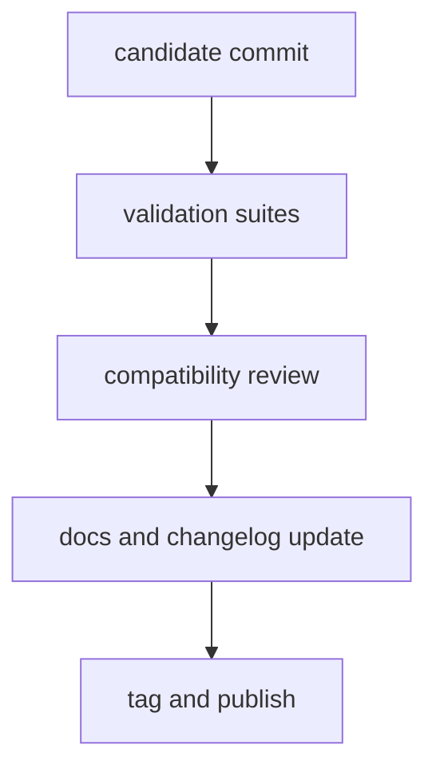

# Release and Versioning

In `bijux-core`, a version is only trustworthy if it points to a verified
repository state that the public crates, docs, generated references, and
release notes all describe consistently.

That is why release policy here is broader than tagging code. A release is a
repository claim about what users can now rely on.

## Release Flow

## What A Release Has To Prove

Before a version boundary is credible, the repository should be able to show:

- the candidate commit passed the relevant verification gates
- the compatibility story matches the actual code and contracts
- public docs and references describe the shipped behavior honestly
- the release note surface reflects the same boundary the binaries do

## Release Rules

- release from verified commits only
- document compatibility impact for all public behavior changes
- ensure CLI and DAG release notes include contract-sensitive updates
- include documentation updates in the same release train

## Versioning Rules

- incompatible behavior changes require explicit major version rationale
- additive, compatible behavior follows minor version policy
- patches must avoid silent contract changes

## Why Patch Releases Need Discipline Too

The easiest way to damage trust is to treat patch versions as if they are free
to move public meaning quietly. Patch releases may fix bugs, but they should
not smuggle in contract changes that readers and automation could reasonably
interpret as compatible stability.

## Code Anchors

- `.github/workflows/`
- `crates/bijux-dev/src/suites/release.rs`
- `crates/bijux-dev/src/commands/cli_release_command.rs`

## Next Reads

- [Compatibility and Schema](compatibility-and-schema.md)
- [Risk and Exceptions](risk-and-exceptions.md)
- [Decision Record Policy](decision-record-policy.md)
