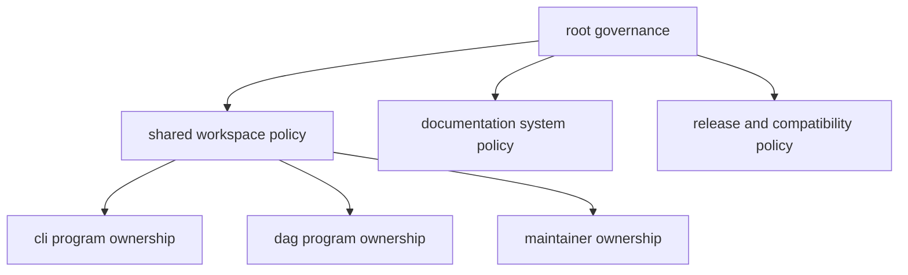

# Repository Scope

Repository scope clarifies what `bijux-core` owns centrally and what belongs to
program-specific handbooks.

## Visual Summary

## In Scope

- workspace membership, shared dependencies, and root build policy
- cross-program compatibility and schema governance
- repository-wide documentation format and navigation standards
- release criteria that span CLI, DAG, and maintainer programs

## Out of Scope

- command semantics that belong only to CLI program docs
- DAG execution semantics that belong only to DAG program docs
- maintainer workflow internals that belong to `bijux-dev` docs

## Code Anchors

- `Cargo.toml`
- `Makefile`
- `mkdocs.yml`
- `docs/index.md`

## Next Reads

- [Package Ownership](package-ownership.md)
- [Compatibility and Schema](compatibility-and-schema.md)
- [Maintainer Handbook](../../bijux-dev/index.md)
