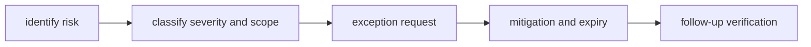

# Risk and Exceptions

`bijux-core` allows exceptions because real repositories encounter urgent
constraints, not because the standards are optional. An exception is acceptable
only when the repository can say exactly what is being relaxed, why it is being
relaxed, who owns the debt, and when that relaxation expires.

The repository becomes unreliable when exceptions are vague, open-ended, or
treated as background context instead of explicit temporary decisions.

## Exception Flow

## Risk Categories

- compatibility drift risk
- release reliability risk
- governance and documentation drift risk
- dependency and supply-chain risk

## What Makes An Exception Legitimate

An exception should exist only when all of these are true:

- the repository cannot wait for the standard path without a concrete cost
- the scope of the relaxed rule is narrowly defined
- there is an immediate mitigation, not only a promise of future cleanup
- a real expiration or revalidation point is named

## Exception Rules

- every exception needs owner, scope, and expiration date
- mitigations must be concrete and testable
- expired exceptions must be closed or renewed with evidence

## Exception Record Template

Use this structure for every exception request:

- `owner`: accountable maintainer
- `scope`: exact affected crate/docs surface
- `reason`: why the standard gate cannot pass now
- `mitigation`: immediate controls while exception is active
- `expiry`: specific date for revalidation or removal

## Bad Exceptions To Avoid

- "temporary" exceptions with no expiry
- exceptions that cover several unrelated surfaces at once
- exceptions that weaken docs or compatibility truth without saying so
- exceptions that move the cleanup burden onto a future release without a plan

## Code Anchors

- `crates/bijux-dev/src/commands/ops.rs`
- `crates/bijux-dev/src/suites/repo.rs`
- `crates/bijux-dev/src/suites/release.rs`

## Next Reads

- [Testing and Validation](testing-and-validation.md)
- [Change Management](change-management.md)
- [Architecture Risks](../architecture/architecture-risks.md)
