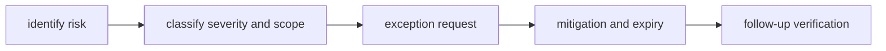

# Risk and Exceptions

This page explains how the repository handles risk without quietly lowering its
standards.

Exceptions exist for situations where work cannot wait, not as a way to leave
gaps unexplained. The important part is that the exception stays named, owned,
and time-bounded.

## Exception Flow

## Risk Categories

- compatibility drift risk
- release reliability risk
- governance and documentation drift risk
- dependency and supply-chain risk

## Exception Rules

- every exception needs owner, scope, and expiration date
- mitigations must be concrete and testable
- expired exceptions must be closed or renewed with evidence

## Exception Record Template

Use this structure for every exception request:

- `owner`: accountable maintainer
- `scope`: exact affected crate/docs surface
- `reason`: why the standard gate cannot pass now
- `mitigation`: immediate controls while exception is active
- `expiry`: specific date for revalidation or removal

## Reading Rule

Use this page when a gate really cannot pass yet and the remaining question is
how to keep that exception explicit instead of normalizing drift.

## Code Anchors

- `crates/bijux-dev/src/commands/ops.rs`
- `crates/bijux-dev/src/suites/repo.rs`
- `crates/bijux-dev/src/suites/release.rs`

## Next Reads

- [Testing and Validation](testing-and-validation.md)
- [Change Management](change-management.md)
- [Architecture Risks](../architecture/architecture-risks.md)
