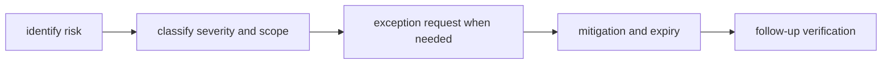

# Risk and Exceptions

Risk and exception policy keeps urgent decisions explicit instead of silently
weakening quality gates.

## Visual Summary

## Risk Categories

- compatibility drift risk
- release reliability risk
- governance and documentation drift risk
- dependency and supply-chain risk

## Exception Rules

- every exception needs owner, scope, and expiration date
- mitigations must be concrete and testable
- expired exceptions must be closed or renewed with evidence

## Code Anchors

- `crates/bijux-dev/src/commands/ops.rs`
- `crates/bijux-dev/src/suites/repo.rs`
- `crates/bijux-dev/src/suites/release.rs`

## Next Reads

- [Testing and Validation](testing-and-validation.md)
- [Change Management](change-management.md)
- [Architecture Risks](../architecture/architecture-risks.md)
