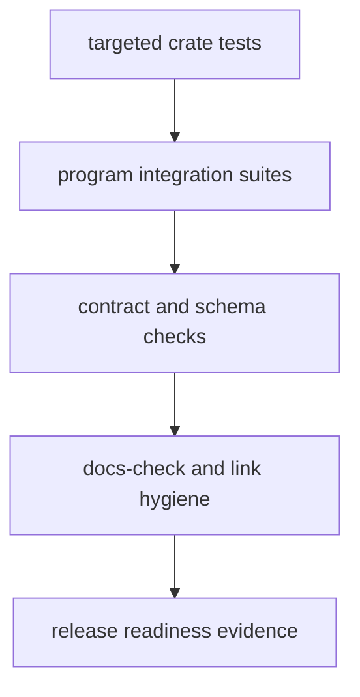

# Testing and Validation

Testing and validation policy aligns workspace checks, program suites, and docs
quality gates into one coherent evidence model.

## Visual Summary



## Validation Layers

- crate-level unit and integration tests in owning packages
- contract suites for public behavior and schema stability
- maintainer governance suites for layout and policy contracts
- documentation checks for structure, links, and publishability

## Required Commands

```bash
cargo test --workspace
make test
make docs-check
cargo run -q -p bijux-dev --bin bijux-dev-cli -- quickcheck --format json --no-pretty
```

## Minimum Review Evidence

- failing-to-passing command outputs for affected surfaces
- contract-test confirmation for schema-sensitive changes
- docs-check output for documentation-affected changes
- explicit note for any skipped check with owner and follow-up date

## Code Anchors

- `makes/rust.mk`
- `makes/docs.mk`
- `crates/bijux-dev/src/suites/test.rs`
- `crates/bijux-dev/src/suites/docs.rs`

## Next Reads

- [Release and Versioning](release-and-versioning.md)
- [Compatibility and Schema](compatibility-and-schema.md)
- [Core Architecture](../architecture/index.md)
