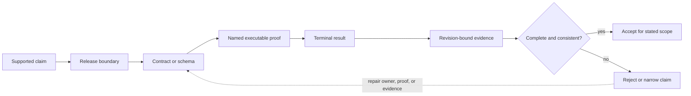

# Repository Trust Evidence

Repository trust is not a test count or a coverage percentage. It is the
ability to connect a supported claim to an owned contract, an executable
proof, and evidence that can be inspected after the check runs.

## Evidence Model

| Layer | Purpose | Representative authority |
| --- | --- | --- |
| product boundary | states what is supported and what remains outside the release | `contracts/foundation/dag_release_truth_table.v1.json` |
| executable specification | defines semantics that tooling and tests enforce | `docs/spec/TEST_TRUST_CONTRACT.md`, `docs/spec/FORMAL_INVARIANTS.md` |
| proof catalog | assigns critical behavior to named tests | `crates/bijux-dag-runtime/tests/fixtures/test_trust_catalog.json` |
| retained evidence | records generated coverage, drift, and comparison results | `docs/reports/governance/` and `evidence/dag/` |
| release verification | proves the installable artifacts, not only the source tree | `docs/spec/RELEASE_BINARY_VERIFICATION.md` |

The layers are complementary. A generated report cannot create a product
promise, and a prose contract without executable proof is an unverified claim.

## Claim Acceptance Flow

Acceptance is scoped. A proof can support only the behavior, platform,
selection, and source identity it evaluated. Missing evidence narrows the
claim; it does not transfer confidence from another package or an older
revision.

## Test Trust Audit

The test-trust catalog groups must-never-break semantics by owned behavior.
Reviewers should ask:

1. Does each supported behavior have a named proof?
2. Does the proof exercise semantics rather than wording, line coverage, or a
   mock that repeats the implementation?
3. Are adversarial, failure, and recovery paths represented where the contract
   depends on them?
4. Does the test stay in the correct fast or slow lane?
5. Can a failure be attributed to one owning crate or contract?

`crates/bijux-dev/tests/test_trust_maintenance_contracts.rs` enforces catalog
shape and references. It does not establish that every listed test is good;
review of the behavior and assertions remains necessary.

## Drift And Comparison Evidence

`docs/spec/ANTI_DRIFT_POLICY.md` defines the drift classes that block or warn.
`docs/reports/governance/DRIFT_DASHBOARD.md` records their current check
mapping. The comparison harness contract separates measured facts from
interpretation so performance or behavior comparisons cannot silently become
product claims. Runtime performance claims are governed by
`evidence/perf/metadata.json` and the
`bijux-dev-dag performance-evidence-report` command; comparison claims use
their scenario-specific evidence under `evidence/compare/`.

Generated evidence is revision-specific. Review its generator, inputs, and
source revision before relying on a conclusion. A stale report must be
regenerated or removed; it must not be edited to resemble the desired result.

## Failure Interpretation

- A missing authority file is a governance defect, even if tests still pass.
- A catalog entry without an executable test is false confidence.
- A passing test that does not reach the claimed behavior is a proof defect.
- A report that disagrees with its contract is stale evidence.
- An installable artifact that differs from source-tree behavior is a release
  failure.

The narrowest proven claim wins until contracts, tests, evidence, and release
artifacts agree.

## Review Record

A trust decision should make these facts inspectable:

| Fact | Required record |
| --- | --- |
| claim | one bounded statement tied to a public or repository contract |
| authority | exact schema, contract, release truth table, or package boundary |
| proof | test, suite, generator, or artifact verification command |
| source | full commit identity and relevant worktree state |
| selection | packages, features, platforms, ignored-test mode, and exclusions |
| outcome | terminal status plus passed, failed, skipped, slow, or leaky counts where emitted |
| retained location | immutable workflow run, release asset, governed report, or local artifact path |
| limitation | unsupported backend, simulated environment, omitted lane, or stale external input |

The record need not be one new file. Existing test logs, generated reports,
release manifests, and review text may provide the chain when they use the
same source identity and do not contradict one another.

## Explicit Limits

This model does not claim formal verification of the full repository, complete
absence of defects, or universal platform coverage. Coverage data helps locate
unexercised code; it is not a substitute for semantic proof. Simulated backend
tests prove modeled behavior only unless a real backend contract says
otherwise.

## Related Authorities

- [Architecture Risks](../architecture/architecture-risks.md)
- [Testing And Validation](../operations/testing-and-validation.md)
- [Documentation System](../foundation/documentation-system.md)
- [Evidence Collection](../../bijux-dev/operations/evidence-collection.md)
