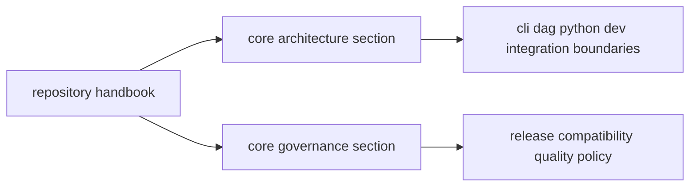

# Repository Handbook

`bijux-core` repository guidance is split into two stable sections:
architecture and governance.

## Visual Summary

## Section Directory

- [Core Architecture](architecture/index.md)
- [Core Governance](governance/index.md)

## When To Use This Handbook

- when a policy affects more than one program handbook
- when ownership boundaries across crates must be clarified
- when release, compatibility, or validation policy is repository-wide

## Program Handbooks

- [CLI Handbook](../bijux-cli/index.md)
- [DAG Handbook](../bijux-dag/index.md)
- [Maintainer Handbook](../bijux-dev/index.md)
