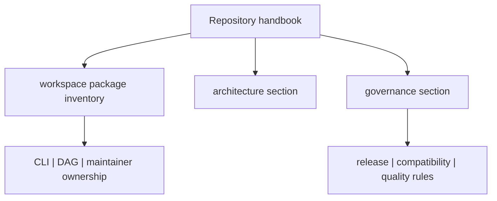

# Repository Handbook

`bijux-core` repository guidance owns the cross-workspace story: why the crate
split exists, where package boundaries live, and which release and governance
rules apply across CLI, DAG, and maintainer surfaces.

<strong>This handbook is the arbitration layer.</strong>
Use it when a change crosses program boundaries, when ownership feels unclear,
or when package-local docs appear to conflict. If one package claim affects the
whole workspace, it belongs here first.

<a class="md-button md-button--primary" href="packages/">Open the repository package inventory</a>
<a class="md-button" href="architecture/">Open architecture</a>
<a class="md-button" href="governance/">Open governance</a>

## Visual Summary

## Start Here

- open [Repository Packages](packages/index.md) to identify which package owns a behavior
- open [Core Architecture](architecture/index.md) to understand workspace structure and dependency direction
- open [Core Governance](governance/index.md) for release, compatibility, risk, and documentation rules

## Task Map

| If you need to... | Start page |
| --- | --- |
| identify the owning package before reading code | [Repository Packages](packages/index.md) |
| understand workspace structure and crate boundaries | [Core Architecture](architecture/index.md) |
| evaluate release, compatibility, or risk policy | [Core Governance](governance/index.md) |
| decide which handbook owns a behavior | [Repository Scope](governance/repository-scope.md) |
| review dependency and ownership constraints | [Dependency Direction](architecture/dependency-direction.md) |

## When To Use This Handbook

- when a policy affects more than one program handbook
- when ownership boundaries across crates must be clarified
- when release, compatibility, or validation policy is repository-wide

## Program Handbooks

- [CLI Handbook](../bijux-cli/index.md)
- [DAG Handbook](../bijux-dag/index.md)
- [Maintainer Handbook](../bijux-dev/index.md)
