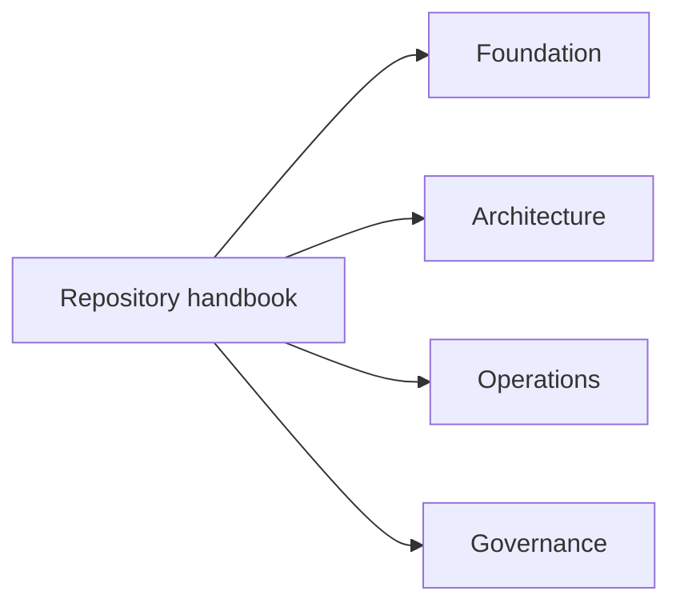

# Repository Handbook

The repository handbook covers the parts of `bijux-core` that sit above any
single product surface. It explains why the workspace is split, where
repository authority begins and ends, and how cross-program architecture,
operations, and release rules stay reviewable.

Open it when a question crosses CLI, DAG, Python bridge, and maintainer
boundaries, or when the handbook tree itself needs a clear owner.

<strong>Use this branch when ownership is broader than one product.</strong>
It is the right route for workspace rules, cross-program architecture, release
boundaries, and shared automation at the repository root.

<a class="md-button md-button--primary" href="foundation/">Open foundation</a>
<a class="md-button" href="architecture/">Open architecture</a>
<a class="md-button" href="operations/">Open operations</a>

## Section Map

## Start Here

- open [Foundation](foundation/index.md) when you still need the repository
  split, ownership model, and vocabulary explained
- open [Core Architecture](architecture/index.md) when the workspace structure
  and dependency direction are the real question
- open [Operations](operations/index.md) when the work is about validation,
  release, review, automation, or repository change flow

## Task Map

| If you need to... | Start page |
| --- | --- |
| understand why the workspace is split the way it is | [Foundation](foundation/index.md) |
| identify the owning package before reading code | [Package Map](foundation/package-map.md) |
| understand workspace structure and crate boundaries | [Core Architecture](architecture/index.md) |
| evaluate release, validation, or review policy | [Operations](operations/index.md) |
| decide which handbook owns a behavior | [Decision Rules](foundation/decision-rules.md) |
| review dependency and ownership constraints | [Dependency Direction](architecture/dependency-direction.md) |

## When To Use This Handbook

- when a policy affects more than one program handbook
- when ownership boundaries across crates must be clarified
- when release, compatibility, or validation policy is repository-wide
- when a root file such as `Makefile`, `mkdocs.yml`, `contracts/`, or
  `.github/workflows/` is part of the answer

## Program Handbooks

- [CLI Handbook](../bijux-cli/index.md)
- [DAG Handbook](../bijux-dag/index.md)
- [Maintainer Handbook](../bijux-dev/index.md)
