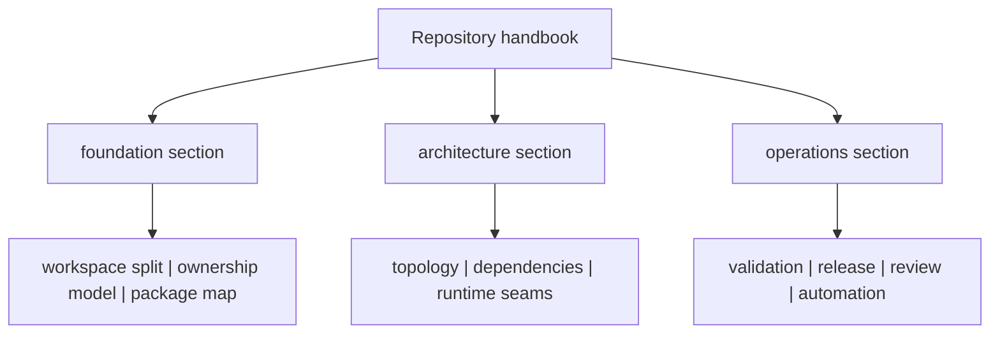

# Core Handbook

The repository handbook explains the parts of `bijux-core` that no single
product handbook can own honestly on its own. It exists to explain why the
workspace is split, where repository authority begins and ends, and how
cross-program architecture and operations stay reviewable.

This root is not a shadow product package. It is where readers should go when a
question crosses CLI, DAG, Python bridge, and maintainer boundaries or when the
handbook tree itself needs arbitration.

<strong>This handbook owns the repository boundary.</strong>
Use it when ownership feels unclear, when a rule affects more than one program
handbook, or when documentation claims need to be checked against root files,
release surfaces, and shared automation.

<a class="md-button md-button--primary" href="foundation/">Open foundation</a>
<a class="md-button" href="architecture/">Open architecture</a>
<a class="md-button" href="operations/">Open operations</a>

## Visual Summary

## Start Here

- open [Foundation](foundation/index.md) when you still need the repository
  split, ownership model, and vocabulary explained
- open [Core Architecture](architecture/index.md) when the workspace structure
  and dependency direction are the real question
- open [Operations](operations/index.md) when the work is about validation,
  release, review, automation, or repository change flow

## Task Map

| If you need to... | Start page |
| --- | --- |
| understand why the workspace is split the way it is | [Foundation](foundation/index.md) |
| identify the owning package before reading code | [Package Map](foundation/package-map.md) |
| understand workspace structure and crate boundaries | [Core Architecture](architecture/index.md) |
| evaluate release, validation, or review policy | [Operations](operations/index.md) |
| decide which handbook owns a behavior | [Decision Rules](foundation/decision-rules.md) |
| review dependency and ownership constraints | [Dependency Direction](architecture/dependency-direction.md) |

## When To Use This Handbook

- when a policy affects more than one program handbook
- when ownership boundaries across crates must be clarified
- when release, compatibility, or validation policy is repository-wide
- when a root file such as `Makefile`, `mkdocs.yml`, `contracts/`, or
  `.github/workflows/` is part of the answer

## Program Handbooks

- [CLI Handbook](../bijux-cli/index.md)
- [DAG Handbook](../bijux-dag/index.md)
- [Maintainer Handbook](../bijux-dev/index.md)

## Purpose

This page routes readers into the repository-level handbook sections without
pretending that the root owns behavior that belongs inside one package.

## Stability

Keep this page aligned with the root sections that actually exist in
`docs/bijux-core/` and the shared repository surfaces that the root genuinely
owns.
