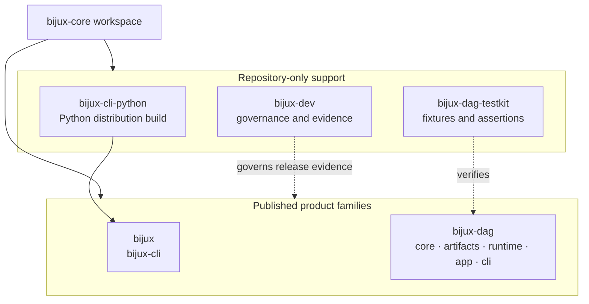
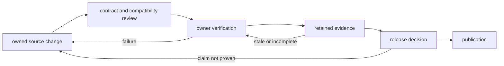

# Repository Handbook

`bijux-core` is the release and compatibility boundary for two public
command-line products. It keeps runtime code, machine-readable contracts,
retained evidence, and publication automation in one workspace so a shipped
claim can be traced to both an implementation owner and a verification owner.

<strong>Use this handbook when the question crosses products.</strong>
If the answer needs both <code>bijux</code> and <code>bijux-dag</code>, or if
it depends on package boundaries, release policy, or shared automation, this
is the right starting point.

<a class="md-button md-button--primary" href="foundation/">Open foundation</a>
<a class="md-button" href="architecture/">Open architecture</a>
<a class="md-button" href="operations/">Open operations</a>

## Start Here

| Question | Best starting page |
| --- | --- |
| What does `bijux-core` publish today? | [Foundation](foundation/index.md) |
| Which package owns this behavior? | [Package Map](foundation/package-map.md) |
| Which crates are public and which stay internal? | [Package Boundary](foundation/package-boundary.md) |
| How is the workspace laid out and why? | [Core Architecture](architecture/index.md) |
| What do contributors run before review or release? | [Operations](operations/index.md) |

## Repository Snapshot

`bijux-core` publishes two public product families:

- `bijux`, the operator-facing command runtime
- `bijux-dag`, the local-first DAG runtime and crate family

It also carries repository-internal support crates that make those products
shippable and auditable:

- `bijux-cli-python` for Python packaging and bridge parity
- `bijux-dag-testkit` for deterministic DAG fixtures and shared assertions
- `bijux-dev` for repository diagnostics, governance, evidence, and release
  tooling

That split matters because many questions that look like one command problem
are really package-boundary or release-boundary questions.

This is an ownership map, not a Cargo dependency graph. Use the
[Package Map](foundation/package-map.md) for package purpose and the
[Package Boundary](foundation/package-boundary.md) before treating a private
support crate as a distributable API.

## Repository Control Loops

Four connected loops keep the workspace coherent:

| Loop | Input | Accepted output | Refusal condition |
| --- | --- | --- | --- |
| runtime | command or graph input | streams and exit status, or a retained DAG run | parsing, validation, execution, integrity, or policy failure |
| contract | schema, invariant, or compatibility rule | machine-checkable agreement between producer and consumer | drift, unknown versions, incompatible meaning, or missing ownership |
| evidence | source revision plus named scenario or suite | retained observation with producer, selection, and status | stale, partial, unverifiable, or non-comparable result |
| release | accepted package set and version | dependency-ordered registry and release artifacts | missing gate, version disagreement, partial publication, or unsupported claim |

The loops are intentionally separate. A runtime success does not satisfy a
release gate. A generated report does not redefine the contract it evaluates.
A private maintainer command cannot widen the product surface.

## Boundary Promises

- Product crates never depend on `bijux-dev` for runtime behavior.
- Public and private package status is explicit and contract-tested.
- Generated references describe the live binaries instead of a manually
  maintained command inventory.
- DAG evidence is retained separately from source and local build products.
- A release claim names its supported lane and does not inherit experimental,
  simulated, or maintainer-only capabilities.
- Partial publication is handled as an incident, not retried as though no
  external state changed.

## Product And Maintainer Handbooks

| Scope | Handbook |
| --- | --- |
| `bijux` routing, config, plugins, state, REPL, and output | [CLI Handbook](../bijux-cli/index.md) |
| graph authoring, execution, artifacts, cache, replay, and comparison | [DAG Handbook](../bijux-dag/index.md) |
| repository gates, evidence generation, automation, and release response | [Maintainer Handbook](../bijux-dev/index.md) |
