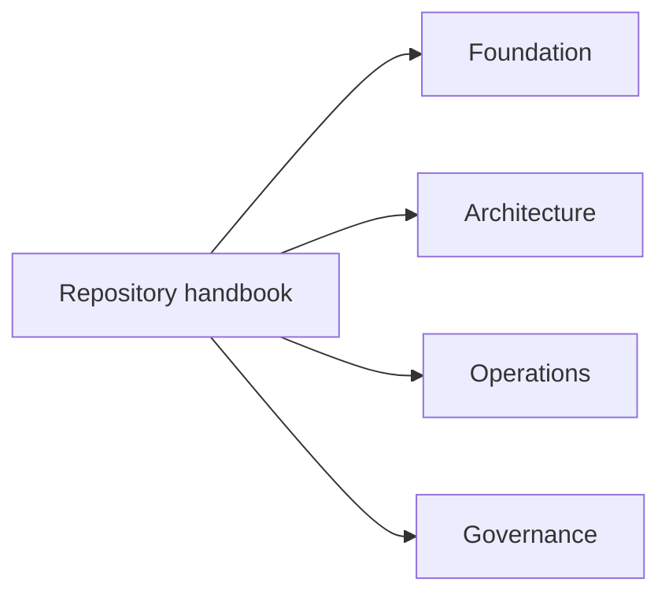

# Repository Handbook

The repository handbook covers the shared ground above any one crate or command
surface. Use it when the question is about publication boundaries, repository
layout, cross-package ownership, release policy, or shared automation.

<strong>Use this branch when ownership is broader than one product.</strong>
It is the right route for workspace rules, cross-program architecture, release
boundaries, and the parts of <code>bijux-core</code> that sit above both public
products.

<a class="md-button md-button--primary" href="foundation/">Open foundation</a>
<a class="md-button" href="architecture/">Open architecture</a>
<a class="md-button" href="operations/">Open operations</a>

## Section Map

## What This Handbook Owns

- repository-wide publication and release boundaries
- shared package and crate ownership rules
- root-level structure such as `crates/`, `contracts/`, `docs/`, `makes/`,
  `.github/workflows/`, and `artifacts/`
- cross-program release, review, and automation expectations
- the split between public product surfaces and private maintainer tooling

## Start Here

- open [Foundation](foundation/index.md) for the product map, package
  boundary, repository layout, and durable terminology
- open [Core Architecture](architecture/index.md) for crate boundaries,
  dependency direction, shared runtime surfaces, and system topology
- open [Operations](operations/index.md) for validation, release, review,
  automation, and contributor workflows

## Task Map

| If you need to... | Start page |
| --- | --- |
| understand what the repository publishes and what stays private | [Foundation](foundation/index.md) |
| identify the owning package before reading code | [Package Map](foundation/package-map.md) |
| confirm which crates are public and in what order they publish | [Package Boundary](foundation/package-boundary.md) |
| understand workspace structure and crate boundaries | [Core Architecture](architecture/index.md) |
| evaluate release, validation, or review policy | [Operations](operations/index.md) |
| decide which handbook owns a behavior | [Decision Rules](foundation/decision-rules.md) |
| review dependency and ownership constraints | [Dependency Direction](architecture/dependency-direction.md) |
| understand how published and internal crates divide responsibility | [Package Map](foundation/package-map.md) |

## When To Use This Handbook

- when a policy affects more than one program handbook
- when ownership boundaries across crates must be clarified
- when release, compatibility, or validation policy is repository-wide
- when README, handbook navigation, or package descriptions must stay aligned
- when a root file such as `Makefile`, `mkdocs.yml`, `contracts/`, or
  `.github/workflows/` is part of the answer

## Repository Scope Snapshot

`bijux-core` currently publishes two product families:

- `bijux`, the operator-facing command runtime
- `bijux-dag`, the deterministic graph execution and evidence system

The workspace also contains repository-internal support crates:

- `bijux-cli-python`, the Python packaging and bridge layer for `bijux`
- `bijux-dag-testkit`, deterministic test support for DAG crates
- `bijux-dev`, maintainer diagnostics, contracts, and release tooling

This handbook is the right starting point when that split, rather than one
concrete command, is the main thing a reader needs to understand.

## Program Handbooks

- [CLI Handbook](../bijux-cli/index.md)
- [DAG Handbook](../bijux-dag/index.md)
- [Maintainer Handbook](../bijux-dev/index.md)
