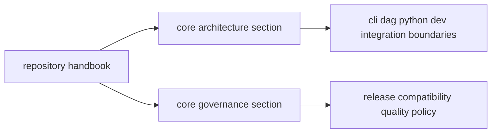

# Repository Handbook

`bijux-core` repository guidance is split into two stable sections:
architecture and governance.

## Visual Summary

## Section Directory

- [Core Architecture](architecture/index.md)
- [Core Governance](governance/index.md)

## Task Map

| If you need to... | Start page |
|---|---|
| understand workspace structure and crate boundaries | [Core Architecture](architecture/index.md) |
| evaluate policy for release, compatibility, and risk | [Core Governance](governance/index.md) |
| decide which program handbook owns a behavior | [Repository Scope](governance/repository-scope.md) |
| review dependency direction and ownership constraints | [Dependency Direction](architecture/dependency-direction.md) |

## When To Use This Handbook

- when a policy affects more than one program handbook
- when ownership boundaries across crates must be clarified
- when release, compatibility, or validation policy is repository-wide

## Program Handbooks

- [CLI Handbook](../bijux-cli/index.md)
- [DAG Handbook](../bijux-dag/index.md)
- [Maintainer Handbook](../bijux-dev/index.md)

## Escalation Rule

If two handbooks appear to conflict, treat this repository handbook as the
first arbitration layer and open with:

1. [Repository Scope](governance/repository-scope.md)
2. [Package Ownership](governance/package-ownership.md)
3. [Change Management](governance/change-management.md)
