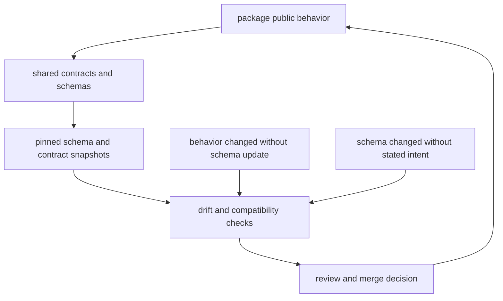

# API and Schema Governance

Repository-level schema work exists to keep package contracts, published docs,
and release expectations aligned.

## Root Governance Surfaces

- shared contract assets under `contracts/`
- package contract tests in CLI, DAG, and maintainer crates
- documentation pages that explain compatibility commitments

## Governance Rule

If a schema or contract change crosses package boundaries, the repository
handbook should explain that change before release notes try to summarize it.

## Next Reads

- [Artifact Governance](artifact-governance.md)
- [Change Management](change-management.md)
- [Compatibility and Schema](../governance/compatibility-and-schema.md)
