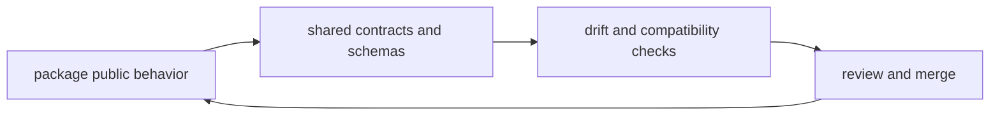

# API and Schema Governance

`bijux-core` carries contracts that are larger than any one crate. Once a
field, status vocabulary, manifest shape, CLI envelope, or replay schema is
depended on across product families, documentation, or release surfaces, it
stops being just a crate-local detail.

This page explains how those shared API and schema changes are kept honest
across code, contracts, docs, and release expectations.

## Governance Map

## Shared Governance Surfaces

- shared contract assets under `contracts/`
- package contract tests in CLI, DAG, and maintainer crates
- documentation pages that explain compatibility commitments

## When A Change Becomes Repository-Level

A schema or API change is repository-level when it affects more than one of the
following:

- a public command or published crate surface
- retained DAG artifacts or manifests
- shared machine-readable outputs
- generated documentation or checked references
- release compatibility or migration expectations

At that point, a crate-local fix is no longer enough. The repository needs one
coherent explanation of the new supported shape.

## What Good Governance Looks Like

Shared API and schema work is in good shape when:

- the owning contract surface is explicit
- dependent tests and snapshots move with the change
- documentation explains the supported behavior in reader language
- compatibility expectations are updated where readers rely on them
- release surfaces do not silently advertise stale structure

## Common Governance Failures

- changing output structure without updating the checked schema or snapshot
- renaming fields while leaving docs and release notes on the old vocabulary
- treating a cross-crate contract as if it were only one crate's implementation
- updating generated references without updating the governing source
- changing meaning while preserving syntax, which is harder to spot but equally risky

## Questions To Ask During A Contract Change

1. who consumes this field, status, or envelope today?
2. where is the governing schema or checked reference?
3. which docs explain the promised behavior?
4. what compatibility or migration expectation does this change create?

## Governance Rule

If a schema or contract change crosses package boundaries, the repository
handbook should explain that change before release notes try to summarize it.

## Next Reads

- [Artifact Governance](artifact-governance.md)
- [Change Management](change-management.md)
- [Compatibility and Schema](../governance/compatibility-and-schema.md)
