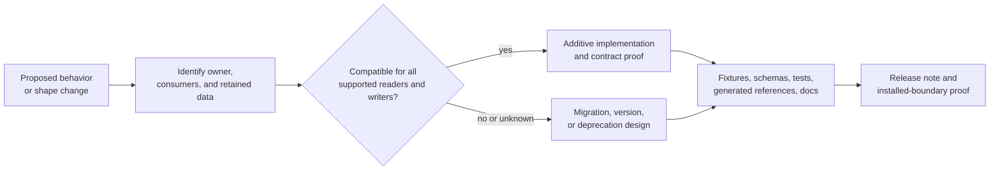

# API and Schema Governance

An API or schema becomes a repository contract when more than one package,
tool, retained artifact, or release consumer depends on its meaning. The owner
still lives at a concrete package or contract path; repository governance
keeps that owner, its consumers, executable proof, documentation, and
migration behavior aligned.

## Contract Change Flow

Do not start by regenerating snapshots. First identify the authority and every
reader and writer. Generated output can reveal a change; it cannot decide
whether the change is compatible.

## Governed Surfaces

| Contract surface | Authority and affected meaning |
| --- | --- |
| CLI output and error envelopes | `contracts/schemas/output-envelope-v1.schema.json`, `error-envelope-v1.schema.json`; fields, status vocabulary, stream and exit semantics |
| configuration | generated and checked configuration schema plus precedence, origin, validation, and redaction behavior |
| plugin manifests | `contracts/schemas/plugin-manifest-v2.schema.json`; discovery, compatibility, capability, and trust declarations |
| public command inventory | owning command implementation, generated reference, completion, machine output, and release lane |
| DAG graphs | graph schema and canonicalization; node, edge, trigger, policy, and identity meaning |
| DAG evidence | manifests, output indexes, traces, attempts, proofs, scheduler checkpoints, and integrity rules |
| replay, diff, and cache | source identity, comparison classification, migration, cache keys, and rejection behavior |
| maintainer evidence | producer command, report schema, selected scope, revision identity, and terminal status |
| package and release boundaries | foundation contracts that distinguish public, private, stable, experimental, simulated, and unreleased surfaces |

The schema file owns serialized shape. It does not replace behavioral
authority. For example, an output envelope schema can require a `status`
field, while the owning command contract determines what each status means and
which exit code accompanies it.

## Compatibility Is About Meaning

Classify compatibility in both directions:

- **new reader, old data:** can the upgraded tool safely interpret retained
  configurations, manifests, reports, and runs?
- **old reader, new data:** can a supported older tool safely ignore an
  additive field, or must the writer declare a new version?
- **new writer, old environment:** do commands, plugins, caches, and backends
  reject unsupported capabilities before mutation?
- **same syntax, new meaning:** has identity, ordering, policy, status,
  retention, or comparison behavior changed despite an unchanged field name?

Unknown versions and required unknown fields fail closed where accepting them
could corrupt state, weaken policy, or misclassify evidence. Optional additive
metadata may be preserved or ignored only when the owning contract permits it.

## Change Requirements

A complete cross-package contract change carries all applicable elements in
one reviewable chain:

1. owner and consumer inventory, including retained data;
2. compatibility classification and release-lane impact;
3. owning implementation and machine-readable contract change;
4. old and new fixtures that exercise valid, invalid, and unknown input;
5. reader/writer, migration, round-trip, or rejection tests;
6. regenerated references produced from the governing source;
7. reader documentation and explicit migration or deprecation guidance;
8. installable-artifact verification before publication.

When a transition requires dual reading, keep one canonical write format and
make the removal condition explicit. Silent fallback between incompatible
meanings is not migration.

## Evidence And Failure Interpretation

| Observation | Interpretation |
| --- | --- |
| implementation changed, schema did not | contract drift; do not publish |
| schema changed, behavior and fixtures did not | unproved declaration; do not publish |
| new fixtures pass but retained old fixtures fail | backward-compatibility break or missing migration |
| snapshots changed without an explained semantic change | possible accidental drift; inspect the producer |
| docs or generated references disagree with the command | stale reader contract |
| source-tree tests pass but packaged smoke fails | release-boundary defect |
| version is unknown but accepted as current | unsafe compatibility ambiguity |

The narrowest verified behavior wins. A release note cannot authorize a shape
that its installed reader, schema, and compatibility tests do not support.

## Source And Proof Anchors

- `contracts/schemas/`
- `contracts/foundation/`
- `crates/bijux-dag-app/tests/`
- `crates/bijux-dev/tests/evidence_schema_contracts.rs`
- `crates/bijux-dev/src/commands/contract_governance.rs`

## Continue Reading

- [Artifact Governance](artifact-governance.md)
- [Change Management](change-management.md)
- [Compatibility and Schema](../governance/compatibility-and-schema.md)
- [Repository Trust Evidence](../governance/trust-evidence.md)
