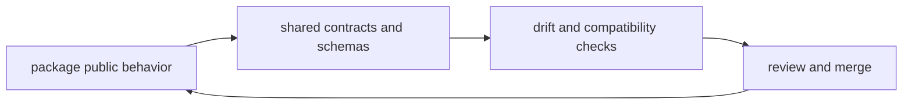

# API and Schema Governance

This page explains how repository-level API and schema work stays aligned across
packages.

The repository branch matters here when a schema or contract stops being a
single-package concern and starts affecting docs, releases, or cross-program
behavior.

## Governance Map

## Root Governance Surfaces

- shared contract assets under `contracts/`
- package contract tests in CLI, DAG, and maintainer crates
- documentation pages that explain compatibility commitments

## Governance Rule

If a schema or contract change crosses package boundaries, the repository
handbook should explain that change before release notes try to summarize it.

## Reading Rule

Use this page when a schema or contract change reaches beyond one package and
needs a repository-level explanation.

## Next Reads

- [Artifact Governance](artifact-governance.md)
- [Change Management](change-management.md)
- [Compatibility and Schema](../governance/compatibility-and-schema.md)
