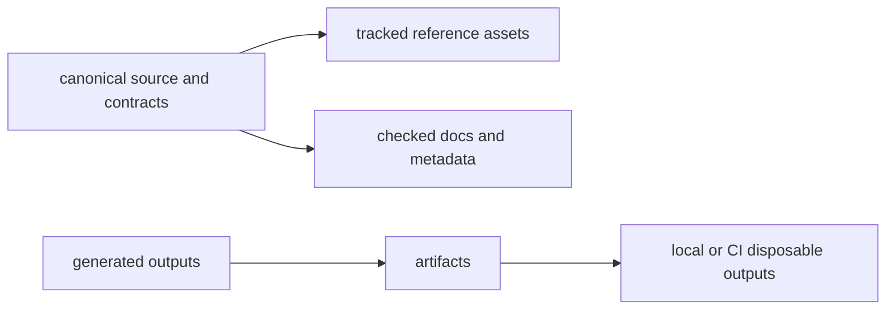

# Artifact Governance

`bijux-core` generates a large amount of useful output: docs sites, reports,
run directories, release bundles, Python build products, and validation logs.
Those artifacts matter, but they are not all source files and they are not all
meant to live forever.

Artifact governance exists so readers and reviewers can answer one question
quickly: is this file part of the repository's canonical truth, or is it a
generated by-product of running the repository?

## Artifact Map

## Core Repository Rule

Tracked source, contracts, and documentation define the supported state.
Generated outputs belong under `artifacts/` unless the explicit purpose of the
run is to refresh a governed destination such as checked documentation or a
release-preparation tree.

## What Belongs In Source

Files usually belong in tracked source when they:

- define runtime behavior
- define a shared contract or schema
- document a supported surface for readers
- provide a checked reference that the repository intentionally publishes

## What Belongs In `artifacts/`

Files usually belong in `artifacts/` when they are created by running the
repository:

- docs build output
- test, lint, and coverage reports
- Python package build products
- local release bundles and validation evidence
- temporary run products consumed by later local steps

## Repository Rules

- generated outputs belong under `artifacts/`
- documentation builds must not create tracked `site/` or `.cache/` roots
- release bundles should be reproducible from tagged source and release-tree
  preparation

## Examples

- docs output under `artifacts/docs/site`
- Python build output under `artifacts/python/build`
- Rust test, lint, and coverage reports under `artifacts/rust/`

## Why This Matters

Without a clear boundary, generated files slowly become accidental source of
truth. That creates several problems:

- reviewers cannot tell which files were authored and which were produced
- disposable outputs get committed by mistake
- local runs contaminate the repository layout
- release and docs builds become less reproducible across machines

## Questions To Ask When A New Output Appears

1. is this file authored, generated, or both?
2. does the repository intentionally publish it, or is it only run evidence?
3. if generated, is there already an owned destination under `artifacts/`?
4. if tracked, what reader or automation contract makes it worth keeping?

## Code Anchors

- `makes/docs.mk`
- `makes/python.mk`
- `makes/rust.mk`

## Next Reads

- [Release and Versioning](release-and-versioning.md)
- [Automation Surfaces](automation-surfaces.md)
- [Maintainer Docs Operations](../../bijux-dev/operations/docs-operations.md)
