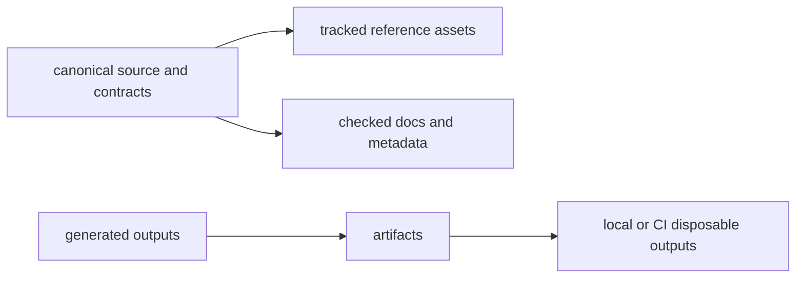

# Artifact Governance

This page explains how generated outputs stay useful without turning into
accidental source of truth.

The rule is straightforward: source stays in tracked roots, generated outputs
stay in `artifacts/`, and review should never have to guess which category a
file belongs to.

## Artifact Map

## Repository Rules

- generated outputs belong under `artifacts/`
- documentation builds must not create tracked `site/` or `.cache/` roots
- release bundles should be reproducible from tagged source and release-tree
  preparation

## Examples

- docs output under `artifacts/docs/site`
- Python build output under `artifacts/python/build`
- Rust test, lint, and coverage reports under `artifacts/rust/`

## Reading Rule

Use this page when a new output file appears and the question is whether it
belongs in source, docs, or disposable artifacts.

## Code Anchors

- `makes/docs.mk`
- `makes/python.mk`
- `makes/rust.mk`

## Next Reads

- [Release and Versioning](release-and-versioning.md)
- [Automation Surfaces](automation-surfaces.md)
- [Maintainer Docs Operations](../../bijux-dev/operations/docs-operations.md)
