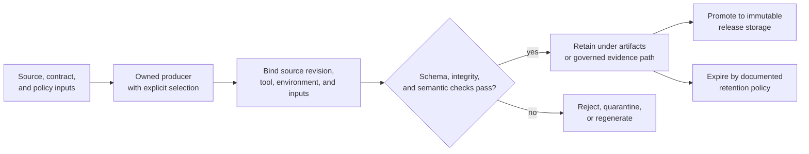

# Artifact Governance

Artifacts serve different trust roles. Some are authored authorities, some are
governed checked-in evidence, some are disposable outputs from a local or CI
run, and some are immutable release products. Treating all four as ordinary
files either pollutes source control or makes generated evidence look more
authoritative than it is.

## Artifact Classes

| Class | Examples | Authority | Lifecycle |
| --- | --- | --- | --- |
| authored source | Rust and Python source, hand-written docs, schemas, policy configuration | defines behavior or a governed contract | reviewed and versioned in Git |
| governed generated content | generated command reference, checked report, release truth table derived by an owned producer | evidence or published reference only for its declared inputs and revision | regenerate, validate, and commit with its source change |
| transient run output | test logs, coverage, built site, local DAG runs, audit reports, package staging trees | proves only the recorded invocation and environment | write under `artifacts/`; retain or discard by run need |
| published artifact | crates, wheels, source archives, containers, checksums, release manifests | installable result bound to an immutable version and source revision | publish atomically where possible; retain by release policy |

A generated report never becomes policy because it is checked in. Its
authority remains bounded by its producer, schema, inputs, freshness, and
validation.

## Evidence Lifecycle

Promotion does not erase provenance. A published artifact must remain
traceable to the exact source, inputs, toolchain, producer, validation result,
and checksum used to create it.

## Destination Decision

Before adding a producer, choose its destination from the consumer contract:

| Question | Result |
| --- | --- |
| Does the file define behavior or policy? | author it at the owning source or contract path |
| Is it a generated public reference or maintained repository record? | write to its governed path, record the producer, and validate before commit |
| Is it needed only to inspect one local or CI execution? | write beneath the repository root `artifacts/` |
| Is it an installable release result? | stage under `artifacts/`, verify there, then publish with immutable identity and checksums |
| Does no consumer or retention reason exist? | do not create or retain it |

Local builds must not create tracked `site/`, `.cache/`, coverage, package, or
run roots. The repository’s Make and script surfaces route these products to
owned locations such as `artifacts/docs/`, `artifacts/python/`,
`artifacts/rust/`, and release staging subtrees.

## Integrity And Transfer

An artifact is safe to transfer or use in a decision only when its relevant
identity is present:

- full source revision and dirty-state declaration;
- producer and tool versions;
- selected packages, features, suites, backend, and exclusions;
- input identities and applicable policy;
- terminal status rather than only a created path or process ID;
- schema version and content hashes where the consumer validates them;
- known limitations, simulation boundaries, and retention owner.

Copying an artifact without its manifest or provenance weakens the evidence.
Editing a generated report to make it pass severs the evidence chain. Regenerate
it from corrected authority instead.

## Security And Failure Handling

- Never place credentials, unredacted environment dumps, signing keys, or
  private registry tokens in a retained report or upload.
- Treat failed and partial output as incident evidence; do not overwrite it
  with a successful rerun.
- Quarantine corrupt state only through an owned recovery command that records
  what moved and why.
- Reject missing hashes, unknown schemas, inconsistent source identities, and
  incomplete publication when the consumer contract requires them.
- Keep public release products separate from private maintainer packages,
  internal reports, and credential-bearing release workspaces.

## Review An Artifact Claim

Ask:

1. Which claim does this artifact support?
2. Which authority and source revision produced it?
3. Did the producer reach a terminal successful state for the claimed scope?
4. Can the consumer verify schema and integrity independently?
5. Is the artifact fresh, complete, appropriately redacted, and retained in
   the right trust domain?

If any answer is unknown, narrow the claim. The existence of a file is not
proof that its producer completed or that its contents are trustworthy.

## Code Anchors

- `makes/docs.mk`
- `makes/python.mk`
- `makes/rust.mk`
- `crates/bijux-dag-artifacts/`
- `crates/bijux-dev/src/report/`

## Continue Reading

- [Release and Versioning](release-and-versioning.md)
- [Automation Surfaces](automation-surfaces.md)
- [Repository Trust Evidence](../governance/trust-evidence.md)
- [Maintainer Docs Operations](../../bijux-dev/operations/docs-operations.md)
