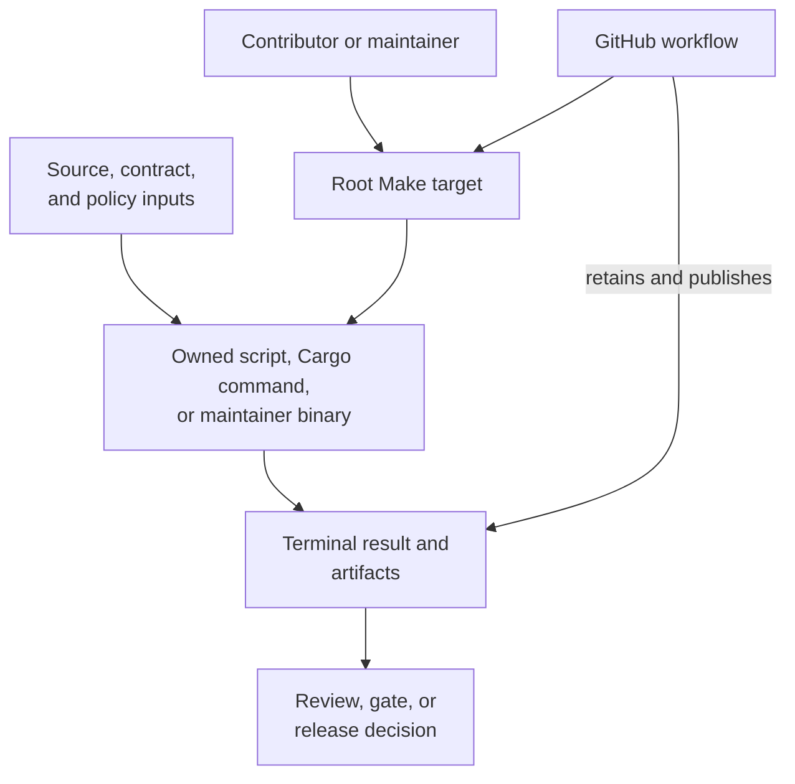

# Automation Surfaces

Repository automation has one execution model across laptops and hosted
runners: a documented Make target composes owned commands, lower-level
implementations produce evidence under `artifacts/`, and CI supplies isolation,
credentials, retention, and status publication. Workflow YAML is an outer
execution boundary, not a separate definition of product or release policy.

## Execution Layers

The same named target should reach the same owned implementation locally and
in CI. Environment setup may differ; required behavior, selection, and exit
meaning must not.

## Responsibility Matrix

| Surface | Owns | Must not own |
| --- | --- | --- |
| root `Makefile` and `makes/` | stable human and CI entrypoints, command composition, artifact routing | product semantics or policy hidden from the invoked owner |
| `crates/bijux-dev` | repository suites, diagnostics, evidence schemas, release-readiness composition | alternate CLI or DAG implementations |
| package tests and commands | package behavior and focused proof | repository-wide conclusions they did not evaluate |
| `.github/workflows/` | hosted triggers, permissions, concurrency, environment, artifact retention, publish credentials | a CI-only substitute for the documented local gate |
| `docs/automation/` | site-specific generators, link and navigation checks, publication preparation | general product execution |
| `artifacts/` | local and CI outputs, logs, prepared trees, reports, built packages and sites | checked-in contract authority |

Generated shared standards and synchronized workflow surfaces remain managed by
their upstream source. Repository-specific automation composes those surfaces;
it does not acquire authority to hand-edit a managed downstream copy.

## Select An Entrypoint

| Intent | Entry boundary |
| --- | --- |
| focused package behavior | the package's documented Cargo, Python, or command test |
| repeatable repository check | an existing root Make target |
| governed suite or evidence report | the owning `bijux-dev-cli` or `bijux-dev-dag` command, normally through Make |
| hosted pull-request or policy check | a workflow that delegates to the same local target |
| release validation | `make release-validate-rs` and the release control-plane checks |
| tag publication | `release-on-tag.yml`, which delegates to registry-specific reusable workflows |
| documentation validation or site build | `make docs-check`, `make bijux-docs-check`, or the documented narrower target |

Call a lower-level script directly only while developing that implementation
or when its contract explicitly names it as the entrypoint. A copied shell
pipeline has no stable selection, evidence, or review boundary.

## Local And CI Parity

For equivalent runs, compare:

- source SHA and worktree cleanliness;
- toolchain and locked dependency inputs;
- selected packages, features, suites, ignored-test mode, and exclusions;
- environment variables that intentionally alter policy or backend behavior;
- exact Make target and owned command;
- artifact paths, terminal status, and timeout or cancellation state.

A difference in any of these facts explains different scope before it proves a
product defect. CI-only credentials and publishing permissions are expected
differences; validation logic is not.

## Failure Attribution

| Symptom | Inspect first |
| --- | --- |
| target is absent or composes the wrong command | root `Makefile` or owning file under `makes/` |
| command runs but evaluates the wrong contract | product owner, suite owner, or `contracts/` input |
| local passes and CI fails before the command | workflow setup, runner image, permissions, toolchain, or cache boundary |
| local and CI invoke different validation | workflow delegation and Make contract |
| command exits but no terminal evidence exists | command orchestration or report producer |
| generated output appears outside its owned root | Make variable, producer path, or workflow staging |
| managed workflow and repository policy disagree | upstream standards source and governed refresh process |
| publication succeeds for only some targets | release incident; reconcile immutable registry identities |

Retries are appropriate for classified transient infrastructure failures, not
deterministic contract, formatting, test, or policy failures.

## Automation Review Record

A trustworthy automated result records the immutable source revision, entry
target, selected scope, tool versions, meaningful environment differences,
terminal outcome, output location, and omissions. A workflow start, background
process ID, cache hit, or uploaded directory alone is not a passing result.

## Source Anchors

- `Makefile`
- `makes/`
- `crates/bijux-dev/src/`
- `.github/workflows/`
- `docs/automation/`

## Continue Reading

- [Contributor Workflows](contributor-workflows.md)
- [Artifact Governance](artifact-governance.md)
- [Release and Versioning](release-and-versioning.md)
- [Maintainer Handbook](../../bijux-dev/index.md)
