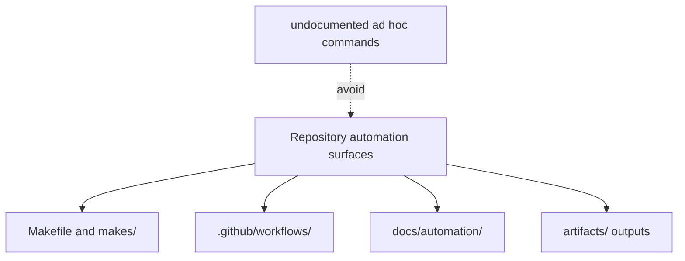

# Automation Surfaces

The repository exposes automation through a small set of root surfaces. They
should be named explicitly so readers can move from documentation to the exact
entrypoint file.

## Root Surfaces

- `Makefile` and `makes/` for local and CI command composition
- `.github/workflows/` for hosted verification and release execution
- `docs/automation/` for documentation publication helpers
- `artifacts/` for generated outputs consumed by later steps

## Surface Rule

Prefer documented entrypoints over bespoke shell commands. A repeated workflow
that bypasses root entrypoints is a documentation and maintenance bug.

## Next Reads

- [Contributor Workflows](contributor-workflows.md)
- [Artifact Governance](artifact-governance.md)
- [Maintainer Handbook](../../bijux-dev/index.md)
