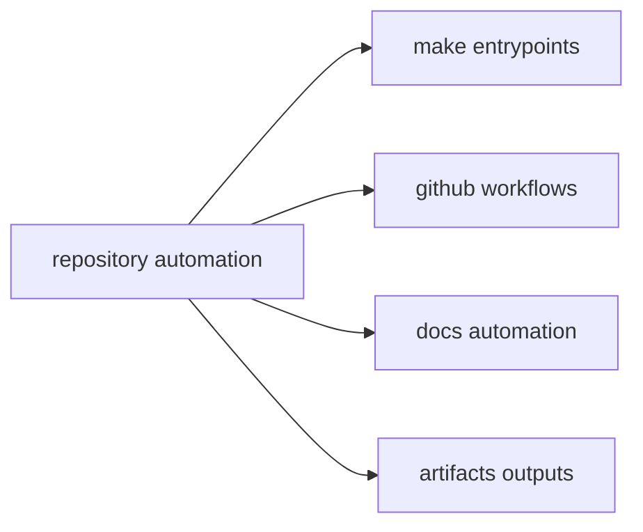

# Automation Surfaces

This page explains where repository automation actually begins.

The aim is not to name every helper script. It is to make the durable
entrypoints obvious so a reader can move from docs to the exact file that owns
the workflow.

## Automation Map

## Root Surfaces

- `Makefile` and `makes/` for local and CI command composition
- `.github/workflows/` for hosted verification and release execution
- `docs/automation/` for documentation publication helpers
- `artifacts/` for generated outputs consumed by later steps

## Surface Rule

Prefer documented entrypoints over bespoke shell commands. A repeated workflow
that bypasses root entrypoints is a documentation and maintenance bug.

## Reading Rule

Use this page when the question is where a repeated repository workflow should
start, not how one helper happens to implement it.

## Next Reads

- [Contributor Workflows](contributor-workflows.md)
- [Artifact Governance](artifact-governance.md)
- [Maintainer Handbook](../../bijux-dev/index.md)
