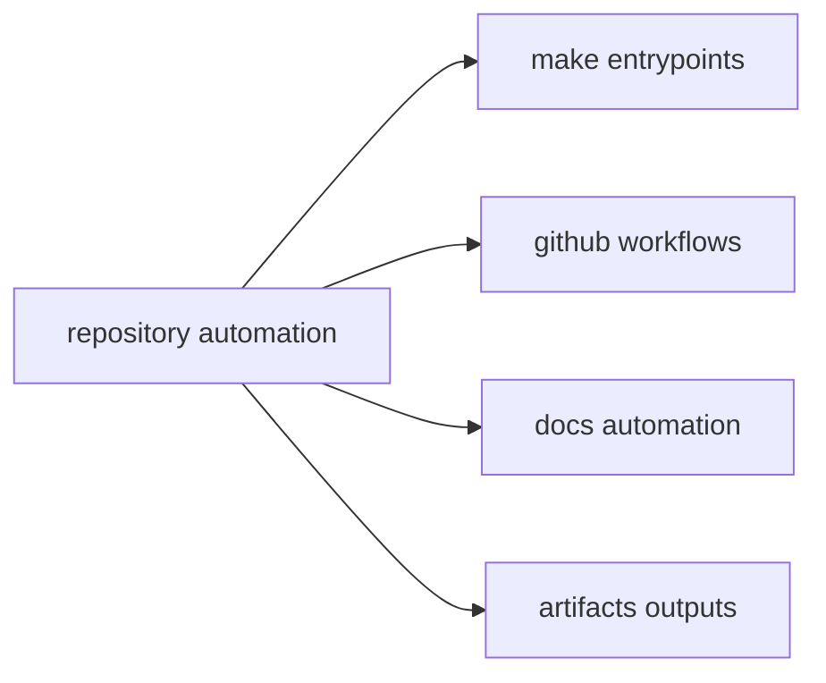

# Automation Surfaces

`bijux-core` contains a lot of automation, but not every helper script is an
entrypoint. This page maps the durable places where contributors and CI should
start a repeated repository workflow.

That distinction matters because maintainable automation depends on shared
entrypoints. If important work only exists as an ad hoc shell command in one
person's history, the repository cannot review, reuse, or govern it properly.

## Automation Map

## Primary Entry Surfaces

- `Makefile` and `makes/` for local and CI command composition
- `.github/workflows/` for hosted verification and release execution
- `docs/automation/` for documentation publication helpers
- `artifacts/` for generated outputs consumed by later steps

## What Each Surface Owns

### `Makefile` and `makes/`

These are the normal starting points for repeatable local and CI work:

- test and lint orchestration
- release and publication helpers
- docs build and validation commands
- packaging and environment setup

If a workflow matters often enough to document, it usually belongs behind a
named make target or a script invoked by one.

### `.github/workflows/`

These files own hosted automation:

- pull request validation
- release automation
- publish and documentation pipelines
- governance and compatibility checks that run in CI

Workflow files should reflect documented repository behavior, not hidden local
knowledge.

### `docs/automation/`

This surface explains how documentation publishing and supporting automation
work. It is the right place when a reader needs to understand how the docs site
is produced rather than how one runtime command behaves.

### `artifacts/`

Generated outputs should land in `artifacts/` unless the point of the command
is to update a governed destination such as `docs/`. This keeps automation
reproducible and prevents disposable run products from becoming accidental
source files.

## How To Choose The Right Entrypoint

Use the highest-level documented entrypoint that already expresses the intent
of the work.

Choose:

- a make target when the workflow should be reproducible locally and in CI
- a GitHub workflow when the concern is hosted validation or release execution
- a docs automation helper when the output is documentation publication
- a lower-level script only when it is clearly the owned implementation of one
  of the surfaces above

## Smells That The Automation Surface Is Wrong

- a repeated workflow exists only in copied shell history
- CI and local instructions describe different commands for the same job
- generated outputs appear outside `artifacts/` without a governed reason
- release behavior depends on a helper that no public entrypoint mentions
- documentation tells readers to run a script directly even though a make
  target already owns the workflow

## Surface Rule

Prefer documented entrypoints over bespoke shell commands. A repeated workflow
that bypasses root entrypoints is a documentation and maintenance bug.

## Next Reads

- [Contributor Workflows](contributor-workflows.md)
- [Artifact Governance](artifact-governance.md)
- [Maintainer Handbook](../../bijux-dev/index.md)
