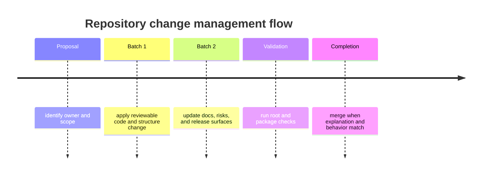

# Change Management

Repository change management exists so cross-package work lands with explicit
ownership, validation, and documentation updates.

## Required Steps

1. identify the owning package and handbook branches
2. classify whether the change is package-local or cross-program
3. run the required root and package checks
4. update docs, risks, and release notes when behavior changes

## Documentation Rule

Behavior changes and handbook changes should land together. Repository fixes
that defer the docs usually create another debugging loop later.

## Next Reads

- [Review Expectations](review-expectations.md)
- [Testing and Validation](testing-and-validation.md)
- [Core Change Management](../governance/change-management.md)
