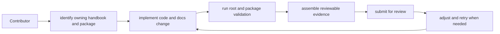

# Contributor Workflows

Contributors should be able to move from issue to owned handbook branch to
verification without reverse-engineering repository customs.

## Standard Flow

1. identify the owning handbook and package family
2. make the change in the owning code and docs
3. run the relevant root and package validation commands
4. include reviewable evidence in the change set

## Workflow Rule

Repository work should reduce manual interpretation. If a reviewer needs tribal
knowledge to understand a root workflow, the docs are incomplete.

## Next Reads

- [Local Development](local-development.md)
- [Review Expectations](review-expectations.md)
- [Change Management](change-management.md)
