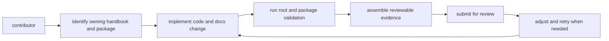

# Contributor Workflows

Good work in `bijux-core` usually crosses code, contracts, documentation, and
repository validation. The contributor workflow exists to make that path
predictable without forcing every change through unnecessary ceremony.

The expected outcome is simple: a reviewer should be able to see what changed,
why it belongs in this repository, and which checks prove the result is ready
to merge.

## Workflow Map

## Standard Flow

1. identify the owning handbook and package family
2. make the change in the owning code and docs
3. run the relevant root and package validation commands
4. include reviewable evidence in the change set

## Start By Finding Ownership

Before editing, answer two questions:

- which product family owns the behavior: `bijux`, `bijux-dag`, or repository
  operations
- which crate or root surface is the canonical owner of the change

That first step prevents a common repository failure mode: fixing the symptom
in a nearby file while leaving the owning docs, contract, or release surface
unchanged.

Typical ownership anchors:

- `crates/bijux-cli/` for operator CLI behavior
- `crates/bijux-dag-*` for DAG runtime, app, CLI, and shared artifacts
- `contracts/` for shared schemas and durable compatibility surfaces
- `docs/` for public explanations and generated references
- root `Makefile`, `makes/`, and `.github/workflows/` for repository operations

## Build One Coherent Change

Once ownership is clear, make the code and documentation move together.

In this repository, that often means:

- update the implementation
- update any affected contract, snapshot, or generated reference
- update the owning handbook or README when public behavior changed
- add or refresh tests that prove the supported state

The repository is harder to review when the behavior lands first and the
explanation arrives later.

## Validate At The Right Level

Local crate tests are necessary, but they are not always sufficient. Many
changes in `bijux-core` have repository-level consequences:

- docs navigation and generated references
- release boundaries and published crate sets
- shared command vocabularies
- retained DAG artifacts and evidence layouts

Run the narrowest useful checks for the surface you changed, then add root
validation when the change crosses package or publication boundaries.

## What Reviewable Evidence Looks Like

A strong change set usually gives reviewers:

- an explicit owning surface
- updated code and updated docs in the same history
- passing local validation for the affected area
- contract or snapshot updates when public meaning changed
- enough context to understand the intended new steady state

## Common Workflow Mistakes

- editing a generated or downstream file instead of the owning source
- updating docs without updating the contract that powers them
- fixing one crate while forgetting the root release or docs surface
- bundling unrelated cleanup into the same review
- relying on private repository customs instead of documented entrypoints

## Workflow Rule

Repository work should reduce manual interpretation. If a reviewer needs tribal
knowledge to understand a root workflow, the docs are incomplete.

## Next Reads

- [Local Development](local-development.md)
- [Testing and Validation](testing-and-validation.md)
- [Review Expectations](review-expectations.md)
- [Change Management](change-management.md)
