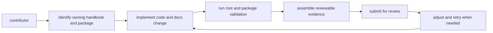

# Contributor Workflows

This page explains the normal path from a question or issue to a reviewable
change.

The goal is not to force one ceremony for every edit. It is to make the default
workflow obvious enough that contributors do not need private repository
customs to work effectively.

## Workflow Map

## Standard Flow

1. identify the owning handbook and package family
2. make the change in the owning code and docs
3. run the relevant root and package validation commands
4. include reviewable evidence in the change set

## Workflow Rule

Repository work should reduce manual interpretation. If a reviewer needs tribal
knowledge to understand a root workflow, the docs are incomplete.

## Reading Rule

Use this page when the work spans more than one file and the first question is
how to move through the repository in the expected order.

## Next Reads

- [Local Development](local-development.md)
- [Review Expectations](review-expectations.md)
- [Change Management](change-management.md)
