# Core Operations

The operations section explains how repository-wide work is carried out once the
ownership model is already clear. These pages cover repeatable root workflows,
not package-local runtime behavior.

```mermaid
flowchart LR
    state["Clean, understood repository state"]
    owner["Identify owning package and contract"]
    change["Implement one coherent change"]
    focused["Run focused verification"]
    broad["Run required repository gates"]
    evidence["Inspect generated and retained evidence"]
    review["Review commit and compatibility impact"]
    release["Release workflow when applicable"]

    state --> owner --> change --> focused --> broad --> evidence --> review
    review -->|release candidate| release
```

The workflow is deliberately evidence-producing. A command starting, a file
being generated, or a focused test passing does not establish repository-wide
completion.

## Choose The Operation

| Need | Start with | Completion evidence |
| --- | --- | --- |
| prepare a checkout or toolchain | [Local Development](local-development.md) | required tools resolve and the intended package builds |
| validate a bounded source change | [Testing and Validation](testing-and-validation.md) | focused owner checks plus every required broader lane |
| change a schema or public API | [API and Schema Governance](api-and-schema-governance.md) | compatibility decision, fixtures, consumers, and migration behavior |
| change automation | [Automation Surfaces](automation-surfaces.md) | local delegation, hosted configuration, and status propagation agree |
| generate or retain evidence | [Artifact Governance](artifact-governance.md) | named producer, destination, integrity, freshness, and review |
| prepare a release | [Release and Versioning](release-and-versioning.md) | package boundary, version set, release gates, and publication inputs agree |
| review a multi-package change | [Review Expectations](review-expectations.md) | ownership, compatibility, evidence, and rollback are explicit |

## Failure Discipline

- Stop when the active branch or worktree cannot be separated safely.
- Preserve every required component failure in aggregate gates.
- Treat stale governed output as a failed condition, not a harmless diff.
- Keep diagnostics and local run products under `artifacts/`.
- Do not widen a product claim because an internal or modeled path compiled.
- Do not release from a state whose source, generated evidence, and version
  authorities disagree.

## Pages In This Section

- [Local Development](local-development.md)
- [Testing and Validation](testing-and-validation.md)
- [Release and Versioning](release-and-versioning.md)
- [API and Schema Governance](api-and-schema-governance.md)
- [Contributor Workflows](contributor-workflows.md)
- [Automation Surfaces](automation-surfaces.md)
- [Artifact Governance](artifact-governance.md)
- [Review Expectations](review-expectations.md)
- [Change Management](change-management.md)

## Reading Rule

Use this section when the question is about repeatable repository work. Switch
back to the CLI or DAG handbooks when the problem is product behavior instead of
root workflow.
