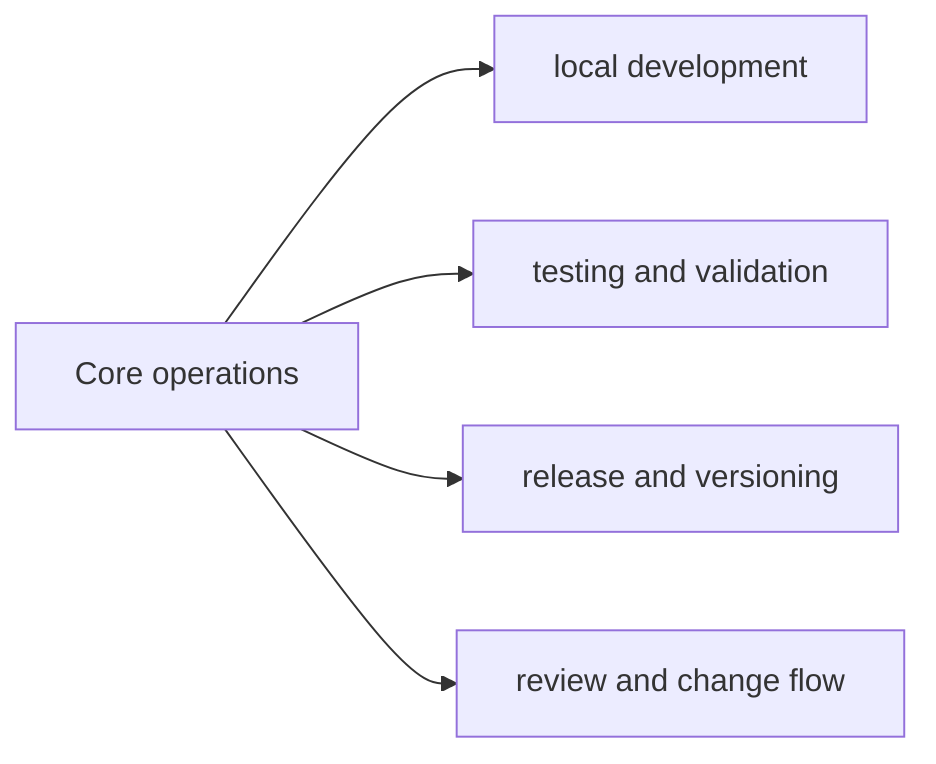

# Core Operations

The operations section explains how repository-wide work is carried out once the
ownership model is already clear. These pages cover repeatable root workflows,
not package-local runtime behavior.

## Pages In This Section

- [Local Development](local-development.md)
- [Testing and Validation](testing-and-validation.md)
- [Release and Versioning](release-and-versioning.md)
- [API and Schema Governance](api-and-schema-governance.md)
- [Contributor Workflows](contributor-workflows.md)
- [Automation Surfaces](automation-surfaces.md)
- [Artifact Governance](artifact-governance.md)
- [Review Expectations](review-expectations.md)
- [Change Management](change-management.md)

## Reading Rule

Use this section when the question is about repeatable repository work. Switch
back to the CLI or DAG handbooks when the problem is product behavior instead of
root workflow.
