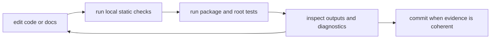

# Local Development

This page explains the default local path for working in `bijux-core`.

The rule is simple: start from documented root entrypoints so local work and CI
keep telling the same story.

## Local Flow



## Baseline Commands

```bash
make install
cargo check --workspace --all-targets
make docs-check
```

Local runs should use the pinned Rust `1.86.0` toolchain from
`rust-toolchain.toml` so the root commands agree with CI and release jobs.

## Local Rule

If a workflow cannot be explained from `Makefile`, `makes/`, or a handbook
page, it is not a healthy repository entrypoint yet.

## Reading Rule

Use this page when the work is local and the main question is which baseline
commands should happen before review.

## Next Reads

- [Contributor Workflows](contributor-workflows.md)
- [Automation Surfaces](automation-surfaces.md)
- [Maintainer Toolchain Setup](../../bijux-dev/operations/toolchain-setup.md)
