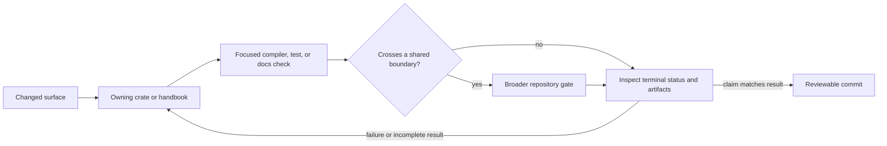

# Local Development

Local development begins with the owning surface and the smallest documented
command that proves it. Repository-wide gates follow when a change crosses
package, contract, release, or publication boundaries.

The rule is simple: start from documented root entrypoints so local work and CI
keep telling the same story.

## Development Topology



The first check should fail for the behavior being changed. A broad gate is
useful after that ownership is established; it is a poor substitute for a
focused reproduction because its failure may not identify the responsible
boundary.

## Baseline Commands

```bash
make bootstrap
make doctor-rs
cargo check --workspace --all-targets --locked
make docs-check
```

Local runs should use the pinned Rust `1.86.0` toolchain from
`rust-toolchain.toml`. That aligns with the source contract and
repository-owned validation workflows. Synchronized generic CI and release
configuration must be audited separately; the
[Maintainer Toolchain Setup](../../bijux-dev/operations/toolchain-setup.md)
records the current hosted-policy mismatch and its upstream ownership.

## Choose The Owning Surface

| Change | Start here | Widen when |
| --- | --- | --- |
| `bijux` Rust behavior | owning `bijux-cli` unit or integration test | routing, output, state, or plugin contracts can change |
| Python distribution or bridge | focused pytest or native bridge test | Rust/Python conversion, packaging, or runtime selection can drift |
| DAG graph semantics | owning `bijux-dag-core` test | serialized identity, planning, application, or runtime behavior can drift |
| DAG execution or artifacts | owning runtime or artifacts test | replay, cache, evidence, or command responses can drift |
| public handbook page | `make docs-check` | generated references or executable specifications also changed |
| maintainer command or report | focused `bijux-dev` test | generated evidence, policy, release, or package boundaries changed |

The [Testing And Validation](testing-and-validation.md) page defines what each
root test lane proves and excludes. Do not describe a focused check as a
workspace pass or a successful background launch as a completed result.

## Working Tree And Outputs

Before running a check, inspect the worktree so its result can be attributed to
the intended change. Keep unrelated edits out of the same commit and direct
transient output to `artifacts/`.

Repository-owned producers are different: a command that intentionally
regenerates a checked-in specification, report, fixture, or reference must
write its governed destination. Review that semantic diff and run the owning
freshness contract before committing it. Do not relocate governed output to
`artifacts/` merely to avoid updating its authority.

## Failure Loop

When a check fails:

1. preserve the first causal diagnostic and terminal status;
2. reproduce the smallest owned behavior;
3. decide whether implementation, fixture, contract, or generated evidence is
   wrong;
4. repair the authority and all consumers in the same coherent change;
5. rerun the focused check, then the boundary gate required by the change.

Retries, advisory selection, and moving a test into a slow lane do not repair a
determinism or correctness defect. If the failure depends on concurrency,
isolate mutable resources per test rather than serializing the complete suite.

## Why Root Entry Points Matter

- They keep local development aligned with CI and release automation.
- They make review evidence easier to reproduce.
- They reduce the chance that a contributor fixes one path while breaking the
  documented one.

## Local Rule

If a workflow cannot be explained from `Makefile`, `makes/`, or a handbook
page, it is not a healthy repository entrypoint yet.

## Development References

- [Contributor Workflows](contributor-workflows.md)
- [Automation Surfaces](automation-surfaces.md)
- [Testing And Validation](testing-and-validation.md)
- [Repository Trust Evidence](../governance/trust-evidence.md)
- [Maintainer Toolchain Setup](../../bijux-dev/operations/toolchain-setup.md)
