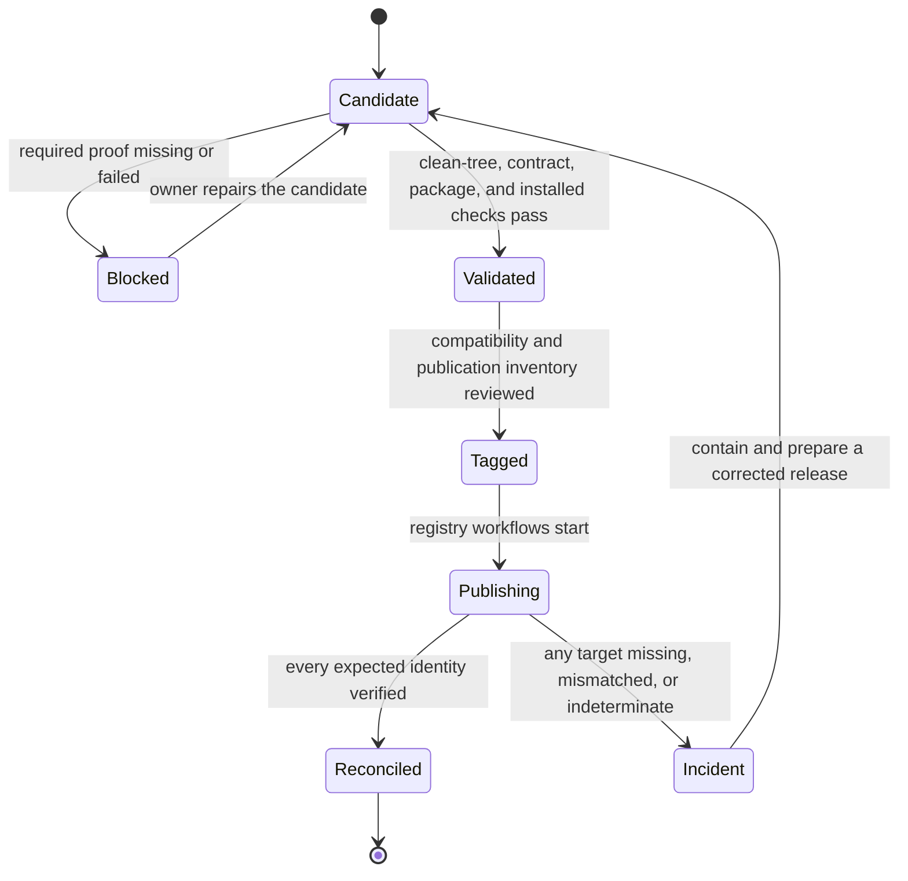

# Release and Versioning

One `bijux-core` tag coordinates two product families and several registries.
A release is complete only when the reviewed source identity, public package
inventory, compatibility statement, installable behavior, documentation, and
published immutable identities agree. A successful upload to one registry is
not a repository release.



There is no valid direct transition from candidate to tag or from partial
publication to reconciled.

## Published Boundary

`contracts/foundation/workspace_package_boundary.v1.json` owns public/private
classification and crates.io order.

| Destination | Public result |
| --- | --- |
| crates.io | `bijux-dag-core`, `bijux-dag-artifacts`, `bijux-dag-runtime`, `bijux-dag-app`, `bijux-dag-cli`, then `bijux-cli` |
| PyPI | the `bijux-cli` Python distribution, backed by the repository-internal native bridge |
| GitHub Releases | stamped CLI and DAG distribution assets, notes, checksums, and supporting release metadata |
| GHCR | versioned CLI and DAG release bundles with immutable digests |
| documentation site | reader handbooks and generated references for supported behavior |

`bijux-cli-python`, `bijux-dag-testkit`, and `bijux-dev` are private
repository support packages. They must not leak into a public Cargo dependency
graph or appear as independent public promises.

## Release Acceptance

A candidate is tag-ready only when:

1. the worktree is clean and the candidate is identified by full commit SHA;
2. public/private package classification and dependency order match manifests,
   generated release policy, and workflows;
3. relevant product, contract, schema, documentation, and release gates pass;
4. the clean release tree packages, dry-run publishes, and smoke-tests the
   installable boundary;
5. public command references and handbooks match the candidate;
6. compatibility, migration, limitations, and rollback ownership are explicit;
7. performance, soak, or live-backend claims cite their separate completed
   evidence rather than borrowing confidence from package validation.

Creating a release tree or starting a validation command is not proof of
completion. Every cited check needs a terminal result for the candidate SHA.

## Version Meaning

| Change class | Release expectation |
| --- | --- |
| incompatible public command, schema, artifact, or crate behavior | breaking-version rationale, migration path, dual-read or rejection policy, and retained-data impact |
| additive compatible behavior | minor release with reader/writer compatibility proof and generated references |
| compatible defect correction | patch release that preserves documented contracts and identifies any changed failure behavior |
| experimental or internal change | no stable promise; lane remains explicit and must not be advertised as released |

A field name, command, or package can remain syntactically unchanged while its
meaning becomes incompatible. Identity, ordering, precedence, policy,
retention, error classification, and replay semantics all count as public
behavior where consumers rely on them.

The DAG release line has additional retained-run and backend considerations in
[DAG Release and Versioning](../../bijux-dag/operations/release-and-versioning.md)
and the [v0.4.0 baseline Release Notes](../../bijux-dag/operations/v0-4-0-release-notes.md).

## Publication Control Flow

The tag workflow delegates to dedicated crates.io, PyPI, GHCR, and GitHub
release workflows. Those workflows may skip an identity already present at the
same version only through their governed idempotency policy; they may not treat
an indeterminate registry probe or a mismatched existing artifact as success.

Registry credentials are confined to the publishing boundary. Build and
validation steps should not receive credentials they do not need. Public
artifacts are staged and inspected before credentialed publication.

## Post-Publication Reconciliation

After publishing, compare immutable identities:

- tag target and full source commit;
- crates.io package versions and expected dependency order;
- PyPI wheel and source-distribution filenames and checksums;
- GitHub release assets, release notes, checksums, and source links;
- GHCR references and content digests;
- deployed documentation revision and expected handbook routes.

Names and version strings alone are insufficient when a checksum, digest, or
tag target can establish the exact result. Record omissions and delayed
targets explicitly.

## Partial Publication

If any required target fails or publishes the wrong identity:

1. stop automatic promotion and mutable aliases;
2. preserve workflow logs, registry responses, artifact checksums, and the
   candidate SHA;
3. classify which identities are public and immutable;
4. do not overwrite an existing immutable release to disguise divergence;
5. prepare a corrected version or governed recovery path;
6. reconcile documentation and release notes with what consumers can actually
   install.

Partial publication is an incident even when retrying later is safe. A release
becomes complete only after every required result is verified.

## Evidence Chain

| Claim | Evidence |
| --- | --- |
| candidate source is reproducible | clean release-tree export and immutable SHA |
| public packages are isolated | package listing, private-dependency rejection, and governed inventory |
| packages can publish in order | locked dry-run publication in contract order |
| installed behavior matches source | release-tree smoke and product contract tests |
| docs match commands and schemas | strict site, generated-reference, link, and navigation checks |
| publication completed | registry checksums or digests reconciled with the tag and expected inventory |
| compatibility is understood | release notes linked to owner contracts, migrations, limitations, and retained-data policy |

## Operational Entrypoints

```bash
make release-validate-rs
make test-release-rs
cargo run -q -p bijux-dev --bin bijux-dev-cli -- release verify
make docs-check
```

Use the narrower development gates before the candidate boundary. The release
suite is intentionally broader because it tests committed, packageable source;
it does not replace Python, performance, soak, or external-environment proof.

## Release References

- [Release Operations](../../bijux-dev/operations/release-operations.md)
- [Release Validation Suite](../../bijux-dev/operations/release-validation-suite.md)
- [Automation Surfaces](automation-surfaces.md)
- [Artifact Governance](artifact-governance.md)
- [Compatibility and Schema](../governance/compatibility-and-schema.md)
- [Risk and Exceptions](../governance/risk-and-exceptions.md)
