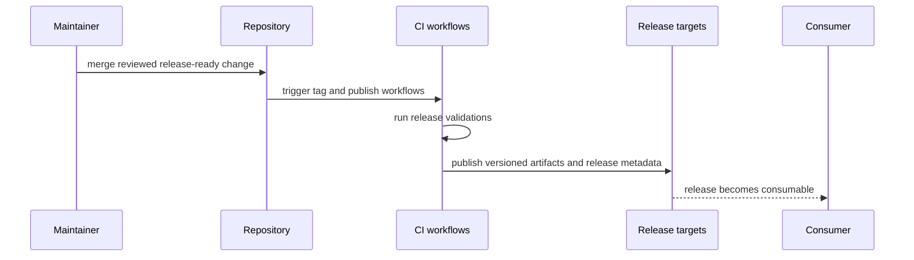

# Release and Versioning

Release work at the repository root coordinates tags, publication workflows,
docs deployment, and release evidence across all published surfaces.

## Current Root Responsibilities

- tag-driven publication for crates.io, PyPI, and GitHub releases
- documentation deployment from `main`
- release-tree stamping and release-note generation
- coordination between CI health and publish decisions

## Release Rule

Never document a release path without naming the workflow file or make target
that actually carries it.

## Next Reads

- [Automation Surfaces](automation-surfaces.md)
- [Artifact Governance](artifact-governance.md)
- [Core Release and Versioning](../governance/release-and-versioning.md)
