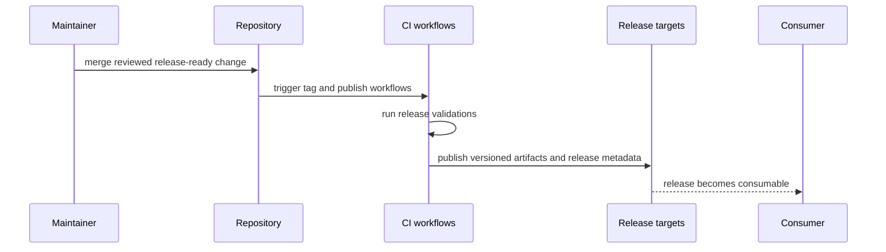

# Release and Versioning

Release work at the repository root coordinates tags, publication workflows,
docs deployment, and release evidence across all published surfaces.



## Current Root Responsibilities

- tag-driven publication for crates.io, PyPI, and GitHub releases
- documentation deployment from `main`
- release-tree stamping and release-note generation
- coordination between CI health and publish decisions

The current DAG operator-facing release framing for the `v0.4.0` line lives in
[v0.4.0 Release Notes](../../bijux-dag/operations/v0-4-0-release-notes.md).

## Release Acceptance

A release is a repository claim about what users can rely on, not merely a
tag. The candidate commit must pass the relevant verification gates, preserve
the stated compatibility boundary, and align public documentation, generated
references, changelogs, and release notes with the binaries being published.

Release only from a verified commit. Contract-sensitive changes require an
explicit compatibility statement and, when consumer action is needed,
concrete migration guidance.

## Version Meaning

| Change class | Versioning expectation |
| --- | --- |
| incompatible public behavior | major-version rationale and migration path |
| additive compatible behavior | minor-version release framing |
| compatible defect correction | patch release without silent contract expansion |

Patch versions may correct behavior, but must not move a public schema,
retained artifact contract, or documented compatibility promise without
acknowledging that change explicitly.

## Release Notes Minimum Template

Every release summary should stay evidence-backed and operator-readable.

```md
# Release <version>

## Summary

- explain what changed in one or two concrete bullets

## Public Behavior Changes

- name operator-visible command, API, schema, or artifact changes
- link the handbook, contract, or migration page for each change

## Compatibility Notes

- state whether the release is fully compatible, conditionally compatible, or intentionally breaking
- name the affected surface and required operator response

## Migration Steps

- list the exact commands, config changes, or rollout actions operators must perform
- say explicitly when no migration is required

## Known Limitations

- link limitations that still apply after the release
- explain whether the release changes the workaround or target audience

## Evidence

- list the release reports, validation artifacts, or benchmark evidence behind the notes
```

## Workflow Ownership

Never document a release path without naming the workflow file or make target
that actually carries it.

## Release References

- [Automation Surfaces](automation-surfaces.md)
- [Artifact Governance](artifact-governance.md)
- [Compatibility and Schema](../governance/compatibility-and-schema.md)
- [Risk and Exceptions](../governance/risk-and-exceptions.md)
