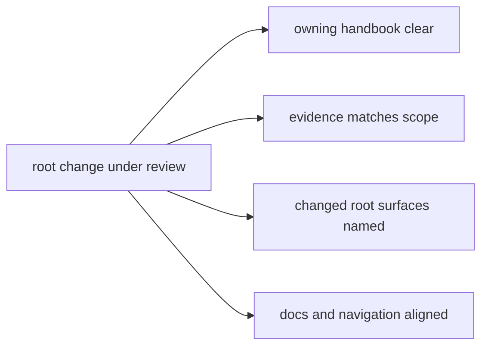

# Review Expectations

Review in `bijux-core` is where the repository checks whether a change is not
only correct in code, but also correctly owned, correctly explained, and
correctly validated.

That bar matters because many repository changes touch more than one durable
surface: public behavior, contracts, generated references, release automation,
and handbook pages. Review is the point where those surfaces are checked
together.

## Review Map

## What Review Should Confirm

- the owning handbook branch is clear
- changed root surfaces are named explicitly
- validation evidence matches the change scope
- docs and navigation stay aligned with the new structure

## The Questions A Good Review Asks

### "Who owns this change?"

The answer should be obvious from the files touched and the explanation in the
change set. If a reviewer cannot tell whether the owner is CLI, DAG, root
operations, or shared contracts, the change is not ready.

### "What public or retained meaning changed?"

Review should identify whether the change affects:

- public command behavior
- machine-readable outputs and schemas
- retained DAG artifacts and manifests
- published docs, examples, or generated references
- release or validation surfaces

### "Does the evidence fit the claim?"

A change that claims to alter only docs should not need runtime release proof.
A change that alters public output should rarely rely on docs-only checks.

The evidence should match the scope, not exceed it randomly and not fall short.

### "Do code and docs still describe the same repository?"

This repository accumulates debt quickly when public explanation lags behind
implementation. Review should check that handbook pages, generated references,
READMEs, and release-facing docs still match the new state.

## Signs A Change Needs More Review Work

- ownership is implied rather than explicit
- the commit mixes several unrelated repository stories
- docs still describe the old shape after a structural change
- validation output does not cover the changed contract or runtime surface
- a root surface changed, but the explanation stays crate-local

## Signs The Review Is Well-Scoped

- the changed surface is easy to name in one sentence
- the commit history follows durable intents
- evidence is narrow but sufficient
- the handbook points readers to the new steady state
- reviewers do not need private repository customs to understand the change

## Review Rule

If the repository shape changed, the handbook should explain the new shape in
the same commit history that introduced it.

## Next Reads

- [Testing and Validation](testing-and-validation.md)
- [Change Management](change-management.md)
- [Decision Record Policy](../governance/decision-record-policy.md)
