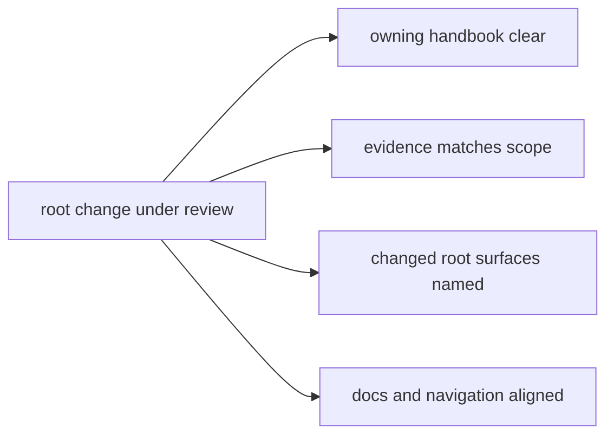

# Review Expectations

This page explains what good repository-level review is supposed to catch.

Root changes are not glue work that gets a lighter bar. They still need clear
ownership, matching evidence, and documentation that explains the new shape
honestly.

## Review Map

## Reviewer Checks

- the owning handbook branch is clear
- changed root surfaces are named explicitly
- validation evidence matches the change scope
- docs and navigation stay aligned with the new structure

## Review Rule

If the repository shape changed, the handbook should explain the new shape in
the same commit history that introduced it.

## Reading Rule

Use this page when a change is technically valid but the review still feels
underspecified.

## Next Reads

- [Testing and Validation](testing-and-validation.md)
- [Change Management](change-management.md)
- [Decision Record Policy](../governance/decision-record-policy.md)
