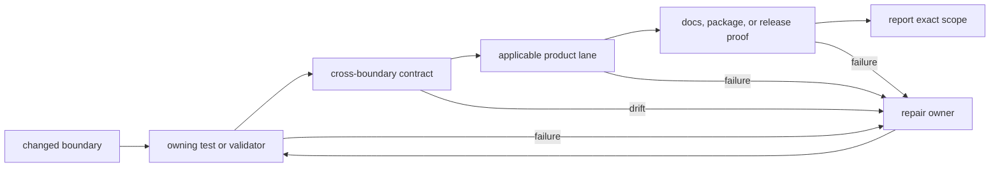

# Testing And Validation

Validation claims must match the lane that produced them. A focused test can
prove one behavior; it cannot prove the workspace, documentation, packaging,
or a different language surface.

Start with the smallest lane that can fail for the change, then widen only when
the changed boundary requires it.



Not every change traverses every node. A documentation-only change can move
from its source checks to the documentation publication lane. A runtime change
usually needs focused behavior, the contracts at its joins, and the owning
product lane. The final claim always records which nodes were omitted.

## Test Lane Contract

| Command | Includes | Excludes | Honest claim |
| --- | --- | --- | --- |
| focused `cargo nextest run ...` or `pytest ...` | explicitly selected tests | every unselected test and gate | named behavior passed |
| `make test` | fast Rust lane plus Python tests marked `not nightly` | governed slow Rust tests, ignored Rust tests, Python `nightly`, docs, lint | default cross-language test lane passed |
| `make test-slow` | Rust tests selected by `slow__` naming or the governed slow roster | ordinary Rust tests and all Python tests | governed slow Rust lane passed |
| `make test-all` | all Rust tests, including ignored tests, with retries disabled | Python, docs, lint, packaging | complete Rust test lane passed |
| `make docs-check` | documentation contracts, source-of-truth checks, strict MkDocs build, navigation and page budget | code tests and lint | published documentation boundary passed |
| `make fmt` | Rust formatting check | Python formatting and all lint/test behavior | Rust source formatting passed |
| `make lint` | workspace Rust Clippy with warnings denied | tests, docs, Python lint | Rust lint lane passed |

The command names are convenient entrypoints, not permission to broaden a
claim. In particular, `make test-all` means all Rust tests in this repository,
not every repository gate.

## Fast And Slow Classification

The Rust fast lane excludes:

- test names matching the configured `slow__` convention;
- tests listed in `configs/rust/nextest-slow-roster.txt`;
- ignored tests unless a complete lane explicitly enables them.

The slow roster exists for expensive tests whose durable names should describe
behavior rather than execution cost. A test belongs in the roster only when
its runtime or environment cost makes it unsuitable for the default lane.

Do not move a failing test into the roster to make `make test` green. Fix the
failure first, then classify cost independently.

Python uses pytest markers. The default Python lane is `not nightly`;
`make test-nightly-py` is the explicit Python nightly lane. It is not currently
aggregated by `make test-slow` or `make test-all`.

## Frozen Complete Rust Gate

Use a frozen gate when the evidence must describe an immutable commit rather
than the live checkout:

```bash
PINNED_REF=<commit> make test-all-frozen
```

The launcher:

1. resolves the ref to a full commit SHA;
2. creates or reuses a clean detached checkout under
   `artifacts/<sha>/frozen-repo/`;
3. starts `make test-all` in the background;
4. writes console, PID, metadata, and terminal status under
   `artifacts/<sha>/background/`;
5. publishes Rust test evidence under `artifacts/<sha>/rust/`.

The launch message proves only that a process started. The result is known
when the status file exists and the console contains the terminal nextest
summary. A missing status file means running, interrupted, or orphaned; it
does not mean passed.

## Choose By Changed Surface

| Changed surface | Minimum useful evidence |
| --- | --- |
| one Rust behavior | focused owning test, then `make test` if shared behavior can drift |
| one Python behavior | focused pytest selection, then `make test` for native bridge risk |
| slow scheduler, stress, or environment behavior | focused test plus `make test-slow` when roster peers share the risk |
| ignored or complete Rust behavior | `make test-all`, or frozen execution for commit-level evidence |
| public command or schema | owning contract tests plus generated-reference checks |
| retained DAG run or artifact behavior | runtime, artifact, replay, and evidence contract tests that cross the changed join |
| Markdown, MkDocs navigation, or documentation automation | `make docs-check` |
| release packaging or publication | [Repository Gates](../../bijux-dev/operations/repository-gates.md) plus [Release Operations](../../bijux-dev/operations/release-operations.md) |

`make dag-test` delegates to the required fast Rust release-profile lane. Use
it when DAG-focused workflow convention calls for that name; it does not add a
different test population.

## Reading Results

A trustworthy test report records:

- the exact command and selection expression;
- the source commit and whether the worktree contained relevant edits;
- passed, failed, skipped, and slow counts from the terminal summary;
- artifact or console path when the run is retained;
- tests or platforms intentionally omitted.

Nextest is configured to continue across failures and print a terminal summary.
The wrapper preserves nextest's exit status after teeing the log. A summary is
evidence about what ran, not a reason to ignore a nonzero result.

## Failure Discipline

When a lane fails:

- read the first causal error and the terminal summary;
- reproduce the smallest failing test without changing its semantics;
- determine whether code, fixture, generated evidence, or the asserted
  contract is wrong;
- check adjacent contracts before changing shared behavior;
- rerun the focused failure and the smallest lane that covers its boundary.

Do not use retries to hide determinism defects, remove assertions to accept
drift, or short-circuit a complete lane after the first failure. Infrastructure
failures should remain distinguishable from test failures in the handoff.

## Evidence Gaps

State gaps directly. Examples:

- `make test` passed; slow Rust and Python nightly lanes were not run.
- focused release contract tests passed; package dry-run publication was not
  run.
- `make docs-check` passed; no product code tests were required for the prose
  change.

This is stronger evidence than saying “all checks passed” when only one lane
ran.

## Documentation Acceptance

Reader-facing changes cross more than Markdown syntax:

| Check | Defect it detects |
| --- | --- |
| shared documentation contract | drift in generated theme, shell, or shared assets |
| badge contract | stale repository and website status blocks |
| strict MkDocs build | malformed configuration, unresolved navigation, plugin failure, and build warnings |
| publication boundary | accidental exposure of specifications, reports, automation, or an oversized site |
| navigation sanity | missing handbook tabs, package routes, or shared chrome |
| source-reference contracts | stale code, command, file, link, or anchor claims |

`make docs-check` composes the documented publication lane. Its success proves
that the curated site builds and passes those contracts at the evaluated
revision; it does not prove product behavior that the documentation merely
describes. Behavioral claims still need the owning executable contract.

## Related Guidance

- [Local Development](local-development.md)
- [Trust Evidence](../governance/trust-evidence.md)
- [Repository Gates](../../bijux-dev/operations/repository-gates.md)
- [Release Operations](../../bijux-dev/operations/release-operations.md)
