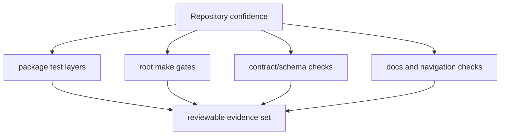

# Testing and Validation

Repository validation combines package-local tests, root make gates, and docs
checks into one reviewable evidence model.



## Canonical Commands

```bash
make test
make dag-test
make docs-check
```

## Validation Rule

Run the owning package checks and the root checks that prove the repository
still publishes, routes, and documents the change honestly.

## Next Reads

- [Review Expectations](review-expectations.md)
- [Change Management](change-management.md)
- [Core Testing and Validation](../governance/testing-and-validation.md)
