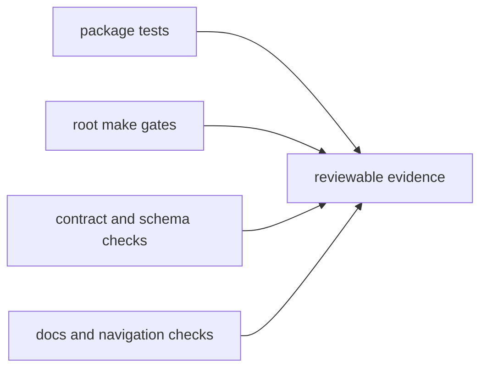

# Testing and Validation

This page explains how repository-level validation turns local work into
reviewable proof.

Package tests are only part of that story. The repository branch also cares
about root gates, docs checks, and the signals that prove the change still fits
the whole workspace.

## Validation Map



## Canonical Commands

```bash
make test
make dag-test
make docs-check
```

## Validation Rule

Run the owning package checks and the root checks that prove the repository
still publishes, routes, and documents the change honestly.

## Reading Rule

Use this page when the code change is clear but the remaining question is which
root-level checks are needed to support review.

## Next Reads

- [Review Expectations](review-expectations.md)
- [Change Management](change-management.md)
- [Core Testing and Validation](../governance/testing-and-validation.md)
