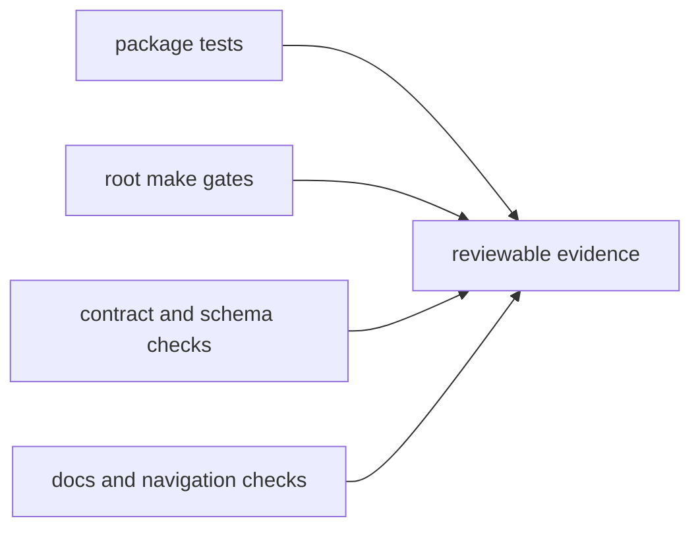

# Testing and Validation

Validation in `bijux-core` is how a code change becomes a supported change.
Local success inside one crate is not enough when the repository also publishes
shared contracts, generated references, retained DAG artifacts, and release
automation.

The goal of validation is not to maximize command count. It is to produce the
smallest set of checks that can honestly prove the repository still behaves as
documented.

## Validation Map



## Canonical Commands

```bash
make test
make dag-test
make docs-check
```

Those commands are examples of root entrypoints, not the entire validation
story. The right proof depends on the surface you changed.

## Choose Checks By Blast Radius

### Crate-local behavior changes

Start with the owning crate's focused tests when the change is clearly bounded
to one implementation surface.

### Public output, schema, or snapshot changes

Add the checks that verify compatibility, golden references, and generated
documentation when public meaning changed.

### Root workflow, release, or documentation changes

Run the repository-level gates that prove the root surface still builds,
routes, and publishes honestly.

### DAG runtime and retained artifact changes

Expect to validate more than one crate, because retained run directories,
manifests, replay outputs, and docs can drift independently if only one suite
is exercised.

## What Good Evidence Looks Like

A strong validation story usually includes:

- the owning crate or package tests
- root validation when the change affects repository-wide behavior
- docs validation when public references or handbook claims changed
- contract and snapshot checks when retained or machine-readable meaning changed
- enough signal to prove the new state is intentional rather than incidental

## Common Under-Validation Mistakes

- running only unit tests for a change that altered public command output
- updating a retained artifact without checking golden snapshots
- changing docs or generated references without a docs build
- changing release or workflow behavior without root validation
- claiming a repository-level fix based on one crate passing locally

## Common Over-Validation Mistakes

Over-validation is also a real cost. It usually looks like:

- running the heaviest gate when a narrow check already proves the change
- repeating large suites after docs-only edits that do not affect runtime meaning
- using broad gates as a substitute for understanding ownership

The best validation set is specific, explainable, and tied to the actual risk.

## Validation Rule

Run the owning package checks and the root checks that prove the repository
still publishes, routes, and documents the change honestly.

## Next Reads

- [Review Expectations](review-expectations.md)
- [Change Management](change-management.md)
- [Core Testing and Validation](../governance/testing-and-validation.md)
