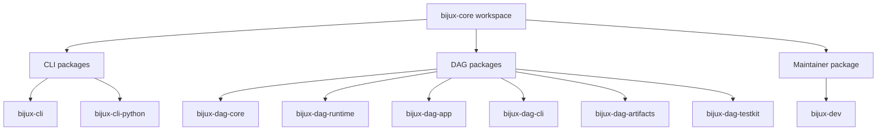

# Repository Packages

`bijux-core` ships one workspace, but it does not ship one idea. The crate
split is the repository contract: runtime command ownership lives in CLI,
deterministic graph and execution ownership live in DAG, and repository
governance lives in Maintainer.

Use this page when you need the fastest honest answer to "which package owns
this behavior?"

This page is the detailed package inventory behind the shorter routing summary
in [Foundation / Package Map](../foundation/package-map.md).

## Visual Summary

## Workspace Map

| Package | Area | Owns | Open Next |
| --- | --- | --- | --- |
| `bijux-cli` | CLI | command parsing, runtime execution, plugins, REPL, structured output | [CLI](../../bijux-cli/index.md) |
| `bijux-cli-python` | CLI | Python packaging, launcher bridge, native module distribution | [CLI](../../bijux-cli/index.md) |
| `bijux-dag-core` | DAG | graph model, parsing, validation, canonicalization, planner lowering | [DAG](../../bijux-dag/index.md) |
| `bijux-dag-runtime` | DAG | run planning, scheduler behavior, replay rules, runtime diagnostics | [DAG](../../bijux-dag/index.md) |
| `bijux-dag-app` | DAG | command orchestration and user-facing response shaping | [DAG](../../bijux-dag/index.md) |
| `bijux-dag-cli` | DAG | thin executable wiring and process-level error mapping | [DAG](../../bijux-dag/index.md) |
| `bijux-dag-artifacts` | DAG | artifact identity, persistence helpers, verification, lifecycle policy | [DAG](../../bijux-dag/index.md) |
| `bijux-dag-testkit` | DAG | deterministic fixtures, builders, shared assertion helpers | [DAG](../../bijux-dag/index.md) |
| `bijux-dev` | Maintainer | release governance, repository evidence, diagnostics, control-plane commands | [Maintainer](../../bijux-dev/index.md) |

## Reading Rule

- open [CLI](../../bijux-cli/index.md) when the question is about the `bijux`
  command, plugin behavior, REPL semantics, or Python installation surfaces
- open [DAG](../../bijux-dag/index.md) when the question is about graph truth,
  execution planning, runtime policy, artifacts, or DAG command behavior
- open [Maintainer](../../bijux-dev/index.md) when the question is about
  repository health, release proof, docs gates, or evidence collection
- stay in the [Repository Handbook](../index.md) only when the question crosses
  those ownership boundaries

## Related Root Pages

- [Foundation](../foundation/index.md)
- [Ownership Model](../foundation/ownership-model.md)
- [Decision Rules](../foundation/decision-rules.md)

## Code Anchors

- `Cargo.toml`
- `crates/bijux-cli/README.md`
- `crates/bijux-cli-python/README.md`
- `crates/bijux-dag-core/README.md`
- `crates/bijux-dag-runtime/README.md`
- `crates/bijux-dag-app/README.md`
- `crates/bijux-dag-cli/README.md`
- `crates/bijux-dag-artifacts/README.md`
- `crates/bijux-dag-testkit/README.md`
- `crates/bijux-dev/README.md`

## Review Lens

- every published package in the workspace should appear here exactly once
- package ownership should route to one handbook branch without ambiguity
- this page should explain the split without duplicating package-local detail
