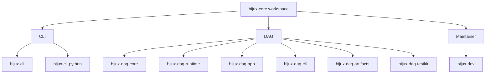

# Core Packages

This page is the quickest way to answer a simple question: which package owns
this behavior?

The workspace stays readable because the split is deliberate. Command and
runtime surfaces live in CLI, graph and execution truth live in DAG, and
repository proof lives in Maintainer.

## Package Map

## Workspace Table

| Package | Area | Owns | Open Next |
| --- | --- | --- | --- |
| `bijux-cli` | CLI | command parsing, runtime execution, plugins, REPL, structured output | [CLI](../../bijux-cli/index.md) |
| `bijux-cli-python` | CLI | Python packaging, launcher bridge, native module distribution | [CLI](../../bijux-cli/index.md) |
| `bijux-dag-core` | DAG | graph model, parsing, validation, canonicalization, planner lowering | [DAG](../../bijux-dag/index.md) |
| `bijux-dag-runtime` | DAG | run planning, scheduler behavior, replay rules, runtime diagnostics | [DAG](../../bijux-dag/index.md) |
| `bijux-dag-app` | DAG | command orchestration and user-facing response shaping | [DAG](../../bijux-dag/index.md) |
| `bijux-dag-cli` | DAG | thin executable wiring and process-level error mapping | [DAG](../../bijux-dag/index.md) |
| `bijux-dag-artifacts` | DAG | artifact identity, persistence helpers, verification, lifecycle policy | [DAG](../../bijux-dag/index.md) |
| `bijux-dag-testkit` | DAG | deterministic fixtures, builders, shared assertion helpers | [DAG](../../bijux-dag/index.md) |
| `bijux-dev` | Maintainer | release governance, repository evidence, diagnostics, control-plane commands | [Maintainer](../../bijux-dev/index.md) |

## Reading Rule

- open [CLI](../../bijux-cli/index.md) for `bijux` command behavior, plugin
  routing, REPL semantics, and Python distribution surfaces
- open [DAG](../../bijux-dag/index.md) for graph truth, execution planning,
  runtime policy, artifacts, and DAG command behavior
- open [Maintainer](../../bijux-dev/index.md) for repository health, release
  proof, docs gates, and evidence collection
- stay in the [Repository Handbook](../index.md) only when the question crosses
  those boundaries

## Related Root Pages

- [Foundation](../foundation/index.md)
- [Ownership Model](../foundation/ownership-model.md)
- [Decision Rules](../foundation/decision-rules.md)

## Code Anchors

- `Cargo.toml`
- `crates/bijux-cli/README.md`
- `crates/bijux-cli-python/README.md`
- `crates/bijux-dag-core/README.md`
- `crates/bijux-dag-runtime/README.md`
- `crates/bijux-dag-app/README.md`
- `crates/bijux-dag-cli/README.md`
- `crates/bijux-dag-artifacts/README.md`
- `crates/bijux-dag-testkit/README.md`
- `crates/bijux-dev/README.md`

## Why This Split Holds

- every published package in the workspace appears here once
- each package routes to one handbook branch without ambiguity
- the table explains ownership without duplicating package-local detail
