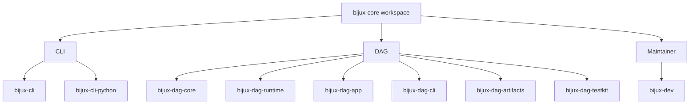

# Core Packages

This page is the fastest way to answer a practical repository question: which
package owns this behavior, and is that package public or repository-internal?

The workspace stays readable because the split is deliberate. Root runtime
surfaces live in CLI, graph and execution truth live in DAG, and repository
proof lives in the maintainer control plane.

For `v0.4.0`, the public release crates are `bijux-cli`, `bijux-dag-core`,
`bijux-dag-artifacts`, `bijux-dag-runtime`, `bijux-dag-app`, and
`bijux-dag-cli`. `bijux-cli-python`, `bijux-dag-testkit`, and `bijux-dev`
remain repository-internal support crates.

The canonical contract for that release status lives in
[Package Boundary](../foundation/package-boundary.md) and
`contracts/foundation/workspace_package_boundary.v1.json`.

## How To Use This Page

- Start with the table below when you know the behavior but not the crate.
- Move to the owning handbook for the full product or maintainer story.
- Move to the package page when you need the exact crate boundary.
- Treat public-versus-private status here as a quick routing aid; the canonical
  release contract still lives in [Package Boundary](../foundation/package-boundary.md).

## Package Map

## Workspace Table

| Package | Release status | Area | Owns | Open Next |
| --- | --- | --- | --- | --- |
| `bijux-cli` | public | CLI | command parsing, runtime execution, plugins, REPL, structured output | [CLI](../../bijux-cli/index.md) |
| `bijux-cli-python` | private | CLI | Python packaging, launcher bridge, native module distribution | [CLI](../../bijux-cli/index.md) |
| `bijux-dag-core` | public | DAG | graph model, parsing, validation, canonicalization, planner lowering | [DAG](../../bijux-dag/index.md) |
| `bijux-dag-runtime` | public | DAG | run planning, scheduler behavior, replay rules, runtime diagnostics | [DAG](../../bijux-dag/index.md) |
| `bijux-dag-app` | public | DAG | command orchestration and user-facing response shaping | [DAG](../../bijux-dag/index.md) |
| `bijux-dag-cli` | public | DAG | thin executable wiring and process-level error mapping | [DAG](../../bijux-dag/index.md) |
| `bijux-dag-artifacts` | public | DAG | artifact identity, persistence helpers, verification, lifecycle policy | [DAG](../../bijux-dag/index.md) |
| `bijux-dag-testkit` | private | DAG | deterministic fixtures, builders, shared assertion helpers | [DAG](../../bijux-dag/index.md) |
| `bijux-dev` | private | Maintainer | release governance, repository evidence, diagnostics, control-plane commands | [Maintainer](../../bijux-dev/index.md) |

## Common Routing Decisions

- Open [CLI](../../bijux-cli/index.md) for `bijux` command behavior, plugin
  routing, REPL semantics, and Python distribution surfaces.
- Open [DAG](../../bijux-dag/index.md) for graph truth, execution planning,
  runtime policy, artifacts, replay, and DAG command behavior.
- Open [Maintainer](../../bijux-dev/index.md) for repository health, release
  proof, docs gates, and evidence collection.
- Stay in the [Repository Handbook](../index.md) only when the question
  genuinely crosses those boundaries.

## What This Table Protects Against

- assuming a repository-internal support crate is part of the published API
- reading the wrong handbook because a command name mentions another product
- changing shared behavior in one package without noticing the real owner

## Related Pages

- [Package Boundary](../foundation/package-boundary.md)
- [Ownership Model](../foundation/ownership-model.md)
- [Package Map](../foundation/package-map.md)
