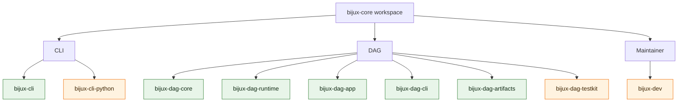

# Package Ownership

Every behavior has one first package owner and one release status. Package
ownership determines where semantics change; release status determines whether
downstream consumers may depend on the crate directly.

The workspace stays readable because the split is deliberate. Root runtime
surfaces live in CLI, graph and execution truth live in DAG, and repository
proof lives in the maintainer control plane.

For `v0.4.0`, the public release crates are `bijux-cli`, `bijux-dag-core`,
`bijux-dag-artifacts`, `bijux-dag-runtime`, `bijux-dag-app`, and
`bijux-dag-cli`. `bijux-cli-python`, `bijux-dag-testkit`, and `bijux-dev`
remain repository-internal support crates.

The canonical contract for that release status lives in
[Package Boundary](../foundation/package-boundary.md) and
`contracts/foundation/workspace_package_boundary.v1.json`.

## Ownership Graph

Green nodes are public Rust crates. Orange nodes are repository-internal Rust
packages; `bijux-cli-python` still produces the public PyPI distribution but is
not itself a crates.io release.

## Route Behavior To Its Owner

| Package | Release status | Area | Owns | Product authority |
| --- | --- | --- | --- | --- |
| `bijux-cli` | public | CLI | command parsing, runtime execution, plugins, REPL, structured output | [CLI](../../bijux-cli/index.md) |
| `bijux-cli-python` | private | CLI | Python packaging, launcher bridge, native module distribution | [CLI](../../bijux-cli/index.md) |
| `bijux-dag-core` | public | DAG | graph model, parsing, validation, canonicalization, planner lowering | [DAG](../../bijux-dag/index.md) |
| `bijux-dag-runtime` | public | DAG | run planning, scheduler behavior, replay rules, runtime diagnostics | [DAG](../../bijux-dag/index.md) |
| `bijux-dag-app` | public | DAG | command orchestration and user-facing response shaping | [DAG](../../bijux-dag/index.md) |
| `bijux-dag-cli` | public | DAG | thin executable wiring and process-level error mapping | [DAG](../../bijux-dag/index.md) |
| `bijux-dag-artifacts` | public | DAG | artifact identity, persistence helpers, verification, lifecycle policy | [DAG](../../bijux-dag/index.md) |
| `bijux-dag-testkit` | private | DAG | deterministic fixtures, builders, shared assertion helpers | [DAG](../../bijux-dag/index.md) |
| `bijux-dev` | private | Maintainer | release governance, repository evidence, diagnostics, control-plane commands | [Maintainer](../../bijux-dev/index.md) |

## Product And Proof Boundaries

- Open [CLI](../../bijux-cli/index.md) for `bijux` command behavior, plugin
  routing, REPL semantics, and Python distribution surfaces.
- Open [DAG](../../bijux-dag/index.md) for graph truth, execution planning,
  runtime policy, artifacts, replay, and DAG command behavior.
- Open [Maintainer](../../bijux-dev/index.md) for repository health, release
  proof, docs gates, and evidence collection.
- Use the [Repository Handbook](../index.md) for release identity, dependency
  direction, and changes that cross product or proof boundaries.

An application route may compose core, runtime, and artifact behavior without
becoming their semantic owner. The CLI binary may expose state diagnostics
without owning Python packaging. Maintainer tooling may verify a public
package without becoming a runtime dependency of that package.

## Boundary Failures

- assuming a repository-internal support crate is part of the published API
- reading the wrong handbook because a command name mentions another product
- changing shared behavior in one package without noticing the real owner

## Authorities

- [Package Boundary](../foundation/package-boundary.md)
- [Ownership Model](../foundation/ownership-model.md)
- [Package Map](../foundation/package-map.md)
